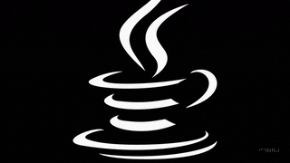

# Introducere

Această pagină oferă acces la documentația suplimentară aferente cursurilor Ingineria Sistemelor de Programe si Structuri Software pentru Aplicatii de Timp Real, Automatica, Universitatea Tehnica din Cluj-Napoca.

Această documentație este în **dezvoltare continuă**. Unele secțiuni pot fi completate treptat, revizuite sau extinse. Vă recomand consultarea regulată pentru a accesa cele mai recente materiale, exemple și exerciții disponibile.

***
