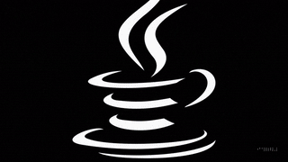

# Ingineria Sistemelor de Programe

***

### Introducere în Java
1. [Introducere în ecosistemul Java](oop-basic/java-ecosystem.md)
2. [Structuri lexiale](oop-basic/01-structuri-lexicale.md)
3. [Structuri repetitive și condiționale](oop-basic/02-structuri-repetitive-conditionale.md)
4. [Tipuri primitive de date și array-uri](oop-basic/03-tipuri-primitive.md)
5. [Manipularea șirurilor de caractere, clasa String](oop-basic/04-String-siruri-de-caractere.md)

### Concepte de baza OOP

1. [Introducere OOP](oop-basic/05-clasa-si-obiect.md)
2. [Pachete](oop-basic/06-pachete-si-librarii.md)
3. [Fisiere Jar](oop-basic/07-fisiere-jar.md)
4. [Agregarea, compozitia si mostenirea](oop-basic/08-concepte-avansate-oop.md)
5. [Clase abstracte si interfete](oop-advanced/01-interfete-clase-abstracte.md)

### Concepte avansate OOP

🧰 Programare Funcțională și Tipuri Avansate

1. [Tipuri generice](oop-advanced/02-tipuri-generice.md)
2. [Optional si null](oop-advanced/03-optional-si-null.md)
3. [Expresii lambda](oop-advanced/07-lamda.md)
4. [Adnotari](oop-advanced/10-adnotarile.md)

📦 Colecții și Manipulare de Date

1. [Colectii de obiecte](oop-advanced/04-colectii.md)
2. [Comparare obiectelor, interfetele Comparator si Comparable](oop-advanced/04-1-interfetele-comparator-comparable.md)
3. [Fluxuri IO](oop-advanced/06-io-streams.md)
4. [Streams API](oop-advanced/05-streams-api.md)

⚠️ Gestionarea Resurselor și a Erorilor

1. [Gestionarea erorilor](oop-advanced/09-gestionarea-erorilor.md)
2. [Try with resources](oop-advanced/08-try-with-resources.md)

🔧 Interfete grafice

1. [Introducere Swing](ui-swing/01-ui-introducere.md)
2. [Exemplu simplu](ui-swing/04-exemmplu-simplu-complet.md)
3. [Exemplu simplu cu scriere in fisier](ui-swing/05-exemplu-scrie-fisier.md)
4. [Lucrul cu tabele](ui-swing/02-ui-tabele.md)
3. [Lucrul cu liste de elemente grafice](ui-swing/03-lists.md)
6. [Sablonul de proiectare MVC](ui-swing/06-mvc.md)

***

### Unified Modeling Language (UML)

📚 Concepte fundamentale

1. [Introducere UML](uml/01-introducere-uml.md)

👥 Diagrame comportamentale orientate pe utilizator\
2\. [Diagrame use-case](uml/02-use-case.md)\
3\. [Documentare diagrame use-case](uml/03-use-case-documentatie.md)

🧩 Diagrame structurale\
4\. [Diagrame de clasa](uml/04-class-diagram.md)\
5\. [Exemplu diagrame de clase](uml/05-class-diagram-exemplu.md)

🔄 Diagrame de interacțiune\
6\. [Diagrame de secvente](uml/06-sequence-diagram.md)\
7\. [Diagrame de comunicare](uml/07-communication-diagram.md)\
8\. [Diagrame de stare](uml/08-state-diagrams.md)

***

### Proiectarea aplicatiilor si Sabloane de proiectare

📋 Procese Software

1. [Introducere în SDLC](oop-design/sdlc-tools-table.md)

🧠 Fundamente OOP\
3\. [Principiile de baza OOP](oop-design/principiile-oop.md)

⚖️ Principii de Design\
3\. [Principiile S.O.L.I.D.](oop-design/principiile-solid.md)\
4\. [Principiul KISS](oop-design/principiul-kiss.md)\
5\. [Principiul DRY](oop-design/principiul-dry.md)\
6\. [Principiul YAGNI](oop-design/principiul-yagni.md)\
7\. [Principiul OCP](oop-design/principiul-ocp.md)

📐 Șabloane de Proiectare\
8\. [Introducere sabloane de proiectare](oop-design/sabloane-introducere.md)\
9\. [Sabloane structurale](oop-design/sabloane-structuralx.md)\
10\. [Sabloane creationale](oop-design/sabloane-creationale.md)\
11\. [Sabloane comportamentale](oop-design/sabloane-comportamentale.md)

***

### Librarii, framwork-uri si tool-uri

1. [Github Actions](tools-basic/github-actions.md)
2. [Masini virtual (VMs) in Azure Cloud](tools-basic/azure-resources.md)
3. [Containere Docker](tools-basic/containere-docker.md)
3. [Versionarea aplicatiilor utilizand Git](tools-basic/introducere-git.md)
2. [Introducere în Maven](tools-basic/introducere-maven.md)
3. [Libraria Lombok](tools-basic/limbraria-lombok.md)
4. [Github actions](tools-basic/github-actions.md)

***

### Validarea cunostintelor

1. [Exercitii introducere in OOP](exercitii-si-intrebari/exercitii-oop-baza.md)
2. [Exercitii agregare compozitie si mostenire](exercitii-si-intrebari/exercitii-oop-avansat.md)
3. [Exercitii interfete si clase abstracte](exercitii-si-intrebari/exercitii-interfete-abstract.md)
4. [Exercitii colectii de obiecte](exercitii-si-intrebari/exercitii-colectii.md)
