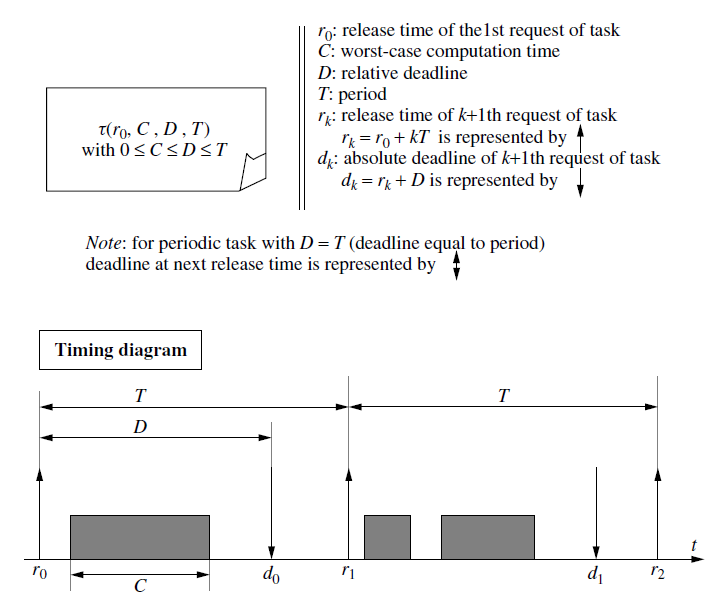
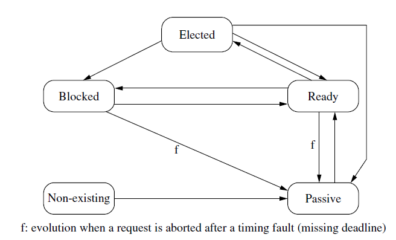
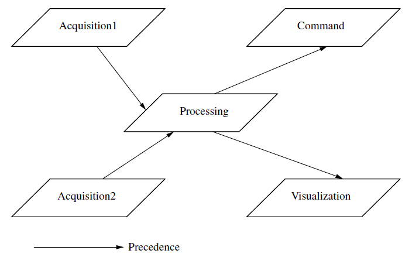
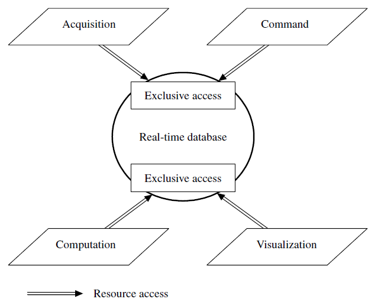

# Documentație Task-uri în Sisteme Real-Time

## 1. Introducere

Task-urile (sarcinile) reprezintă entitățile execuționale de bază care sunt planificate în sistemele real-time. Acestea constituie elementele fundamentale ale oricărei aplicații real-time și trebuie să respecte constrângeri temporale stricte.

Task-urile pot fi clasificate în funcție de mai multe criterii:

- **După periodicitate**: periodice sau aperiodice
- **După constrângeri**: soft real-time sau hard real-time
- **După comportament**: preemptive sau non-preemptive

Înțelegerea corectă a modelului de task și a parametrilor asociați este esențială pentru proiectarea și implementarea sistemelor real-time fiabile.

## 2. Modelul Task-ului

Un task este definit prin două categorii principale de parametri:

- **Parametri cronologici** - reprezintă întârzieri și momente în timp
- **Parametri cronometrici** - reprezintă durate de timp și intervale

Acești parametri se împart în:

- **Parametri primari**: definiți la proiectare, caracterizează cerințele task-ului
- **Parametri dinamici**: calculați în timpul execuției, reflectă starea curentă

### 2.1 Parametri Primari

Fiecare task este caracterizat de următorii parametri primari, care definesc comportamentul său temporal:

#### **r (release time)**

Momentul de declanșare a cererii de execuție a task-ului. Reprezintă timpul la care task-ul devine gata pentru execuție și poate fi văzut ca momentul în care sistemul recunoaște nevoia de a executa task-ul respectiv. Pentru task-uri periodice, există release times succesive.

#### **C (worst-case computation time)**

Timpul maxim de calcul necesar task-ului când procesorul este alocat complet acestuia, fără întreruperi sau preempțiuni. Acest parametru trebuie determinat prin analiza detaliată a codului sau prin măsurători extensive. Este esențial ca valoarea lui C să fie:

- **Realistă**: să reflecte cazul cel mai defavorabil
- **Conservatoare**: să includă toate ramurile posibile de execuție
- **Verificabilă**: să poată fi validată prin testare

#### **D (relative deadline)**

Întârzierea maximă acceptabilă pentru procesarea task-ului, măsurată de la momentul release time. Reprezintă constrângerea temporală cea mai importantă și definește cât timp are sistemul la dispoziție pentru a finaliza execuția task-ului.

Pentru task-uri cu constrângeri **hard real-time**, depășirea deadline-ului poate avea consecințe catastrofale (eșecul sistemului, pierderi materiale sau umane). Pentru task-uri **soft real-time**, depășirea ocazională a deadline-ului este tolerabilă, dar degradează calitatea serviciului.

#### **T (period)**

Perioada task-ului, valabilă doar pentru task-uri periodice. Reprezintă intervalul de timp constant între două activări consecutive ale task-ului. Task-urile periodice sunt comune în aplicații de control, achiziție de date sau procesare de semnale.

#### Deadline-ul Absolut

Pentru task-uri cu constrângeri hard real-time, deadline-ul relativ permite calcularea **deadline-ului absolut**:

**d = r + D**

Depășirea deadline-ului absolut cauzează o **eroare de timing** (timing fault), care trebuie detectată și gestionată de sistem. În funcție de criticitatea task-ului, sistemul poate:

- Declara eșecul aplicației
- Activa mecanisme de recovery
- Înregistra eroarea pentru analiză ulterioară

### 2.2 Task-uri Periodice

Un task periodic este modelat prin cei patru parametri anteriori: (r, C, D, T). Acest tip de task este caracteristic aplicațiilor de monitorizare și control, unde acțiuni trebuie efectuate la intervale regulate.

La fiecare perioadă, task-ul generează o **cerere periodică** (request), care trebuie procesată conform constrângerilor temporale.

#### Momentele de lansare succesive

Pentru un task periodic, release times-urile sunt calculate astfel:

- **rₖ = r₀ + kT**

unde:

- **r₀** este prima lansare (release time inițial)
- **rₖ** este a k+1-a lansare (k = 0, 1, 2, ...)
- **k** reprezintă indexul cererii

#### Deadline-urile absolute succesive

Fiecare cerere periodică are propriul deadline absolut:

- **dₖ = rₖ + D**

Aceasta înseamnă că fiecare instanță a task-ului periodic trebuie finalizată înainte de propriul deadline.

#### Cazuri speciale

**D = T** (deadline egal cu perioada): Task-ul trebuie finalizat înainte de următoarea activare. Aceasta este situația cea mai comună și simplifică analiza de schedulability.

**D < T**: Task-ul trebuie finalizat înaintea perioadei următoare, lăsând un buffer temporal.

**D > T**: Task-ul poate avea deadline-ul după următoarea activare (mai rar întâlnit).

#### Condiție de bună formare

Un task este **bine format** dacă respectă inegalitatea:

**0 < C ≤ D ≤ T**

Această condiție asigură că:

- Task-ul necesită timp de execuție pozitiv (C > 0)
- Timpul de execuție nu depășește deadline-ul (C ≤ D)
- Deadline-ul nu depășește perioada (D ≤ T)

Încălcarea acestei condiții face task-ul neplanificabil din start.



### 2.3 Task-uri Aperiodice

Task-urile aperiodice nu au parametrul T (perioadă). Ele sunt activate de evenimente externe sau interne, cu momente de activare imprevizibile. Exemple:

- Răspuns la comenzi utilizator
- Procesare evenimente asincrone
- Gestionare excepții

### 2.4 Parametri Derivați

Din parametrii primari se calculează indicatori importanți pentru analiza sistemului:

#### **u = C/T** - Factorul de utilizare a procesorului

Reprezintă fracțiunea de timp procesor necesară task-ului. Pentru un task:

- **u ≤ 1** (condiție necesară)
- Valori apropiate de 1 indică utilizare intensivă

Pentru un set de n task-uri, utilizarea totală este:

- **U = Σ(Cᵢ/Tᵢ)** pentru i = 1 la n

Conform teoriei Rate Monotonic Scheduling (RMS), pentru n task-uri cu D = T:

- **U ≤ n(2^(1/n) - 1)** garantează schedulability
- Pentru n → ∞, limita este aproximativ 0.69 (69%)

#### **ch = C/D** - Factorul de încărcare a procesorului

Similar cu u, dar folosește deadline-ul în loc de perioadă. Util când D ≠ T.

- **ch ≤ 1** (condiție necesară)

### 2.5 Parametri Dinamici

Acești parametri evoluează în timpul execuției și permit monitorizarea stării task-ului:

#### **s** - Momentul de start al execuției

Momentul real când task-ul începe să se execute pe procesor.

#### **e** - Momentul de finalizare al execuției

Momentul real când task-ul își termină execuția.

#### **D(t) = d - t** - Deadline-ul relativ rezidual

Timpul rămas până la deadline la momentul t.

- **0 ≤ D(t) ≤ D**
- Descrește linear cu timpul
- Când D(t) = 0, deadline-ul este atins

#### **C(t)** - Timpul de execuție rămas

Timpul necesar pentru finalizarea task-ului la momentul t.

- **0 ≤ C(t) ≤ C**
- Descrește doar când task-ul este în execuție
- Când C(t) = 0, task-ul este finalizat

#### **L = D - C** - Laxitatea nominală (Slack time)

Reprezintă **timpul maxim cu care poate fi întârziată pornirea** task-ului, presupunând că acesta va avea acces exclusiv la procesor. Interpretări:

- **L > 0**: există marjă temporală
- **L = 0**: task-ul trebuie să înceapă imediat
- **L < 0**: task-ul nu poate respecta deadline-ul (chiar cu execuție imediată)

#### **L(t) = D(t) - C(t)** - Laxitatea reziduală

Timpul maxim disponibil pentru întârzieri la momentul t. Formula alternativă:

- **L(t) = D + r - t - C(t)**

Laxitatea este folosită în algoritmi de scheduling dinamici (ex: Least Laxity First).

#### **TR = e - r** - Timpul de răspuns

Timpul total dintre activarea task-ului și finalizarea sa.

- **C ≤ TR ≤ D** (când nu există erori de timing)
- **TR > D** indică depășirea deadline-ului

Timpul de răspuns include:

- Timpul de așteptare în ready state
- Timpul efectiv de execuție
- Întreruperile cauzate de preempțiuni

#### **CH(t) = C(t)/D(t)** - Încărcarea reziduală

Raportul dintre timpul de execuție rămas și timpul până la deadline.

- **0 ≤ CH(t) ≤ C/T**
- Valori mari indică urgență crescută
- La finalizare: CH(e) = 0

### 2.6 Evoluția parametrilor dinamici

Parametrii dinamici evoluează diferit în funcție de starea task-ului:

#### Când task-ul este **în execuție** (elected):

- **L(t+1) = L(t)** - laxitatea rămâne constantă
- **D(t+1) = D(t) - 1** - deadline-ul rezidual scade
- **C(t+1) = C(t) - 1** - timpul de execuție rămas scade

#### Când task-ul este **în așteptare** (ready sau blocked):

- **L(t+1) = L(t) - 1** - laxitatea scade
- **D(t+1) = D(t) - 1** - deadline-ul rezidual scade
- **C(t+1) = C(t)** - timpul de execuție rămas constant

Aceste evoluții sunt fundamentale pentru algoritmii de scheduling bazați pe laxitate sau deadline.

## 3. Stările Task-urilor

În sistemele real-time cu partajare de procesor și resurse, task-urile evoluează printr-un model de stări. Tranziția între stări este determinată de scheduler și de disponibilitatea resurselor.

### 3.1 Stările principale

#### **Elected (Ales/În execuție)**

Task-ul are un procesor alocat și execută instrucțiuni. În această stare:

- **C(t)** descrește (progres în execuție)
- **D(t)** descrește (timpul trece)
- **L(t)** rămâne constantă (nu se pierde timp)

Un singur task poate fi în această stare pe un procesor la un moment dat (în sisteme monocore).

#### **Blocked (Blocat)**

Task-ul așteaptă o condiție externă:

- O **resursă** ocupată de alt task
- Un **mesaj** de la alt task sau din exterior
- Un **semnal de sincronizare**

În această stare:

- **L(t)** descrește (se pierde timp)
- **D(t)** descrește (timpul trece)
- **C(t)** rămâne constantă (nu progresează)

Blocarea poate cauza **inversiune de prioritate** dacă nu este gestionată corect (ex: prin Priority Inheritance Protocol).

#### **Ready (Gata/Pregătit)**

Task-ul este pregătit pentru execuție și așteaptă alocarea procesorului. Este în competiție cu alte task-uri ready. În această stare:

- **L(t)** descrește (se pierde timp)
- **D(t)** descrește (timpul trece)
- **C(t)** rămâne constantă (nu progresează)

Timpul petrecut în ready state contribuie la timpul de răspuns, dar nu la progresul task-ului.

#### **Passive (Pasiv)**

Task-ul nu are cereri curente de execuție:

- Pentru task-uri periodice: între finalizare și următoarea activare
- Pentru task-uri aperiodice: după finalizare, până la o nouă activare

Nu consumă resurse de sistem în această stare.

#### **Non-existing (Neexistent)**

Task-ul nu este creat în sistem. Stare specifică sistemelor cu creare dinamică de task-uri.

### 3.2 Tranziții între stări



## 4. Caracteristici Suplimentare ale Task-urilor

### 4.1 Task-uri Preemptive și Non-preemptive

#### **Task-uri Non-preemptive (Imediate)**

Odată aleși pentru execuție, **nu pot fi întrerupte** până la finalizare. Caracteristici:

- **Simplitate**: nu necesită salvare/restaurare context
- **Predictibilitate**: durata de execuție este fixă
- **Dezavantaj**: pot cauza întârzieri pentru task-uri mai prioritare

**Cazuri de utilizare**:

- Gestionarea **DMA** (Direct Memory Access) I/O
- Execuție în **mod întrerupere**
- Secțiuni critice foarte scurte
- Operații hardware care nu pot fi întrerupte

**Exemplu**: Un task care configurează un controler DMA trebuie să finalizeze secvența de configurare atomică, altfel hardware-ul poate ajunge într-o stare inconsistentă.

#### **Task-uri Preemptive**

Pot fi **oprite și resetate** în starea ready pentru a permite execuția altor task-uri mai prioritare. Caracteristici:

- **Flexibilitate**: îmbunătățește responsivitatea sistemului
- **Complexitate**: necesită mecanisme de salvare context
- **Overhead**: timpul de comutare între task-uri

**Avantaje**:

- Permite respectarea deadline-urilor task-urilor urgente
- Îmbunătățește utilizarea procesorului
- Esențiale pentru sisteme cu multiple priorități

**Cost de preempțiune**: Include timpul pentru:

- Salvarea contextului task-ului curent
- Restaurarea contextului task-ului nou
- Cache invalidation și pipeline flush

### 4.2 Dependențe între Task-uri

Task-urile rareori sunt complet independente. Ele interacționează și se sincronizează în multiple moduri.

#### Relații de Precedență

Task-urile pot avea o **ordine parțială de execuție**, reprezentată printr-un **graf static de precedență**. Acest graf este cunoscut înainte de execuție.



**Implicații**:

- Task-ul succesor nu poate începe până când toți predecesorii săi sunt finalizați
- Necesită mecanisme de sincronizare (semafoare, events, mesaje)
- Influențează analiza de schedulability

#### Resurse Partajate și Secțiuni Critice

Task-urile pot partaja resurse (altele decât procesorul):

- **Baze de date** real-time
- **Buffere** de comunicație
- **Dispozitive** hardware
- **Structuri de date** partajate

Unele resurse trebuie accesate în **excludere mutuală** (mutual exclusion):

- Doar un task poate accesa resursa la un moment dat
- Altfel: inconsistență de date, race conditions

**Secțiune critică**: Secvența de instrucțiuni care accesează o resursă exclusivă. Trebuie protejată prin:

- **Mutex** (mutual exclusion)
- **Semafoare binare**
- **Monitoare**

**Exemplu practic**:



```
Task Achiziție:
  ...
  <LOCK bază de date>
  scrie_date_senzor()
  <UNLOCK bază de date>
  ...

Task Vizualizare:
  ...
  <LOCK bază de date>
  citește_date_senzor()
  <UNLOCK bază de date>
  ...
```

#### Probleme asociate partajării resurselor

**Inversiune de prioritate**: Un task cu prioritate înaltă poate fi blocat de unul cu prioritate joasă, indirect.

**Blocaj (Deadlock)**: Două sau mai multe task-uri se blochează reciproc, așteptând resurse deținute de celelalte.

**Soluții**:

- **Priority Inheritance Protocol (PIP)**
- **Priority Ceiling Protocol (PCP)**
- **Deadline ordering în accesul la resurse**

#### Task-uri Independente

Task-urile sunt **independente** când:

- Nu au relații de precedență
- Nu partajează resurse critice

Task-uri independente sunt mai ușor de analizat și scheduler.

#### Timpul de Răspuns Global (End-to-End Delay)

Pentru task-uri cu dependențe, se definește **timpul de răspuns global**:

- Timpul între **release time** al primului task (reactive la stimul)
- Și **finish time** al ultimului task (care comandă actuatorul)

Acest timp include:

- Timpii de execuție ai tuturor task-urilor din lanț
- Timpii de așteptare și blocare
- Timpii de comunicare între task-uri

**Exemplu**: Sistem de control în buclă închisă:

- Release senzor → Execuție achiziție → Comunicare → Execuție control → Comunicare → Execuție comandă
- **End-to-end delay** = suma tuturor acestor timpi

### 4.3 Jitter Maxim

Pentru anumite aplicații, nu este suficient să respectăm deadline-urile - avem nevoie și de **regularitate** în execuție.

#### Aplicații care necesită jitter redus

**Eșantionare periodică de date**: Variatii în momentele de eșantionare distorsionează semnalul și pot introduce erori în procesare.

**Bucle de control PID**: Algoritmii de control presupun periodicitate exactă. Jitter-ul poate cauza:

- Oscilații în sistem
- Degradarea performanței de control
- Instabilitate

**Streaming audio/video**: Jitter-ul cauzează:

- Discontinuități în redare
- Buffer underruns/overruns
- Degradarea calității percepute

#### Definiții

**Jitter de start time**: Diferența între timpul de start real și timpul de start teoretic ideal.

Pentru două cereri consecutive i și i+1:

- Timpul ideal: **sᵢ₊₁ = sᵢ + T**
- Jitter: **|sᵢ₊₁ - (sᵢ + T)|**

**Jitter maxim (absolut)**: **|sᵢ₊₁ - (sᵢ + T)| ≤ Gₘₐₓ**

**Jitter de response time**: Similar, dar pentru timpul de finalizare.

#### Tehnici de reducere a jitter-ului

- **Priorități fixe ridicate** pentru task-uri sensibile
- **Time-triggered scheduling**: execuție la momente predefinite
- **Buffering** pentru compensare
- **Interrupt handlers** dedicați pentru evenimente critice

### 4.4 Urgență

**Urgența** unui task este direct legată de deadline-ul său. Reprezintă cât de repede trebuie procesate datele furnizate de task.

**Principiu**: Cu cât deadline-ul este mai apropiat, cu atât task-ul este mai urgent.

**Task-uri cu urgență egală**:

- Primesc același deadline
- Au aceeași prioritate în algoritmi bazați pe deadline (EDF - Earliest Deadline First)

**Utilizare**: Urgența este folosită de algoritmi de scheduling dinamic pentru a decide ordinea de execuție.

### 4.5 Importanță (Criticalitate)

Importanța este **independentă de urgență** și reprezintă criticitatea task-ului pentru aplicație.

#### Distincția urgență vs. importanță

Două task-uri pot avea:

- **Aceeași urgență** (același deadline)
- **Importanțe diferite** (unul este critic, altul este opțional)

**Exemplu**:

- Task de **monitorizare siguranță**: urgență medie, importanță critică
- Task de **actualizare display**: urgență medie, importanță redusă

#### Utilizare în sistem

În situații de **supraîncărcare** (overload), când nu toate task-urile pot respecta deadline-urile:

- Sistemul poate **suprima** task-uri cu importanță redusă
- Task-urile critice sunt **protejate**
- Se minimizează impactul asupra funcționalității esențiale

**Strategii de gestionare overload**:

- **Degradare grațioasă** (graceful degradation)
- **Load shedding**: eliminarea task-urilor mai puțin importante
- **Mode changes**: comutare între moduri de funcționare

#### Clasificare după importanță

- **Critice**: Nu pot fi suprimate (siguranță, funcționalitate de bază)
- **Importante**: Preferabil să fie executate
- **Opționale**: Pot fi suprimate fără consecințe grave (confort, vizualizare)

