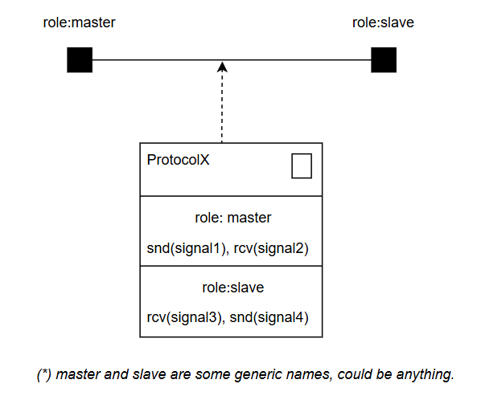

# Modelarea sistemelor în timp real folosind UML-RT

------

*Bazat pe lucrarea „Using UML for Modeling Complex Real-Time Systems” (Selic & Rumbaugh, 1998)*
*Traducere, sinteză și clarificări pentru uz intern in cadrul materiei SSATR.*
[UML for Modeling Complex Real-Time Systems](../paper-UML-for-Modeling-Complex-Real-Time.pdf)

## 1. Introducere

Sistemele software în timp real – întâlnite în domenii precum **telecomunicații**, **aerospațial**, **apărare** sau **control automat** – sunt caracterizate prin **complexitate ridicată**, **reacții dependente de timp** și **interacțiuni concurente**.
Pentru a gestiona această complexitate, se utilizează o **arhitectură component-bazată**, fundamentată pe conceptul de **capsulă (capsule)**.

Modelul UML-RT derivă din limbajul **ROOM (Real-Time Object-Oriented Modeling)** și extinde UML prin mecanismele sale de *stereotipuri* (`«capsule»`, `«port»`, `«protocol»`, etc.) pentru a descrie clar structura și comportamentul sistemelor reactive.

O diagramă UML cu capsule vizualizează structura și comunicarea componentelor într-un sistem în timp real, bazat pe evenimente. Este o formă specializată a unei diagrame de structură compozită UML, folosind o capsulă—un obiect activ, încapsulat—ca bloc de construcție fundamental.

------

## 2. Construcții de bază ale modelului

Modelarea în UML-RT se bazează pe două categorii de concepte:

- **Structurale**: descriu entitățile arhitecturale și relațiile dintre ele
  (capsule, porturi, conectori)
- **Comportamentale**: descriu modul în care aceste entități reacționează la evenimente
  (protocoale, mașini de stare)

------

## 3. Modelarea structurii

### 3.1 Conceptele principale

| Concept                   | Rol                                                          | Analog real               |
| ------------------------- | ------------------------------------------------------------ | ------------------------- |
| **Capsule** (`«capsule»`) | Unități arhitecturale autonome, pot conține alte capsule și o mașină de stare internă | Sub-sistem sau dispozitiv |
| **Porturi** (`«port»`)    | Interfețe prin care capsulele comunică, implementând roluri de protocol | Prize de comunicație      |
| **Conectori**             | Legături logice între porturi, care transportă semnale definite de protocoale | Cabluri / canale de rețea |

------

### 3.2 Capsule

Capsulele reprezintă **componente active** care:

- pot trimite și primi semnale;
- pot conține **sub-capsule** interconectate;
- pot fi controlate de o **mașină de stare** proprie;
- comunică **exclusiv prin porturi**, fără acces direct la alte capsule.

Capsulele pot fi:

- **simple**, cu comportament definit doar de mașina de stare;
- **compuse**, conținând o rețea internă de capsule și conectori;
- **dinamice**, capabile să creeze și să distrugă sub-capsule la execuție.

------

### 3.3 Porturi

Un **port** este un obiect de frontieră (*boundary object*) care:

- face legătura dintre capsulă și mediul exterior;
- implementează un **rol de protocol** (adică un set de semnale admise);
- are propria identitate și stare distinctă de cea a capsulei.

#### Tipuri de porturi:

| Tip port       | Descriere                                                    | Vizibilitate        |
| -------------- | ------------------------------------------------------------ | ------------------- |
| **Relay port** | retransmite semnale între capsule fără procesare; folosit pentru exportarea interfețelor interne | Public              |
| **End port**   | conectat la mașina de stare; are o coadă de mesaje (mailbox) pentru semnale primite | Public sau Protejat |

------

### 3.4 Conectori

Un **conector** reprezintă canalul prin care două porturi comunică.
El **nu definește comportament**, ci doar transportă semnale definite de protocolul asociat porturilor conectate.

Un conector este valid **numai dacă** leagă **porturi care implementează roluri complementare ale aceluiași protocol** (ex. `master ↔ slave`).

------

## 4. Modelarea comportamentului

### 4.1 Protocoale

Un **protocol** este descrierea **contractului de interacțiune** dintre două sau mai multe părți.

Definește:

- **rolurile** implicate (ex. master, slave);
- **semnalele** permise pentru fiecare rol (ce se trimite și ce se primește);
- (opțional) **ordinea validă** a acestor semnale, printr-o mașină de stare a protocolului.

#### Structura unui protocol (exemplu)

```text
«protocol»
ProtocolA
  roles:
    master: send(start, stop), receive(ack)
    slave: send(ack), receive(start, stop)
```

------

### 4.2 Relația dintre **protocol**, **porturi** și **conectori**

1. **Protocolul** definește regulile de comunicare – ce semnale sunt permise și între ce roluri.
2. **Portul** implementează un **rol de protocol**, adică joacă o parte din acel contract.
3. **Conectorul** leagă **porturi complementare** ale aceluiași protocol, permițând transferul de semnale.

#### Reprezentare grafică:




------

### 4.3 Mașinile de stare

Fiecare capsulă poate avea o **mașină de stare** internă care definește:

- reacțiile la semnale primite prin porturi de tip *end*;
- semnalele transmise către alte capsule;
- controlul sub-capsulelor dinamice (creare, distrugere, activare).

#### Tipuri de declanșatoare

- **Event-based triggers** – declanșate de semnale;
- **Port-based triggers** – permit tratarea diferită a aceluiași semnal în funcție de portul care l-a primit.

#### Modelarea comportamentului abstract

UML-RT permite moștenirea mașinilor de stare și extinderea comportamentului prin *chain states* (`«chainState»`) – stări speciale care leagă tranziții multiple într-un singur pas de execuție (run-to-completion).

------

### 4.4 Serviciul de timp

Timpul este tratat ca o resursă sistemică.
Capsulele pot accesa un **Time Service** printr-un port de tip *service access point*, pentru a primi evenimente de tip *timeout* sau pentru a programa acțiuni la momente precise.

------

## 5. Sinteză conceptuală

```
[Protocol]
   ├── defines → roles (master, slave)
   │      ├── each defines → allowed signals (send/receive)
   │
   └── may define → state machine (valid message order)
   
[Port]
   ├── realizes → one protocol role
   └── implements → behavior for sending/receiving signals

[Connector]
   ├── connects → ports of complementary roles
   └── carries → signals defined in the protocol

[Capsule]
   ├── owns → ports, subcapsules, connectors
   └── controlled by → state machine
```

------

## 6. Beneficii arhitecturale

| Principiu                                | Descriere                                                    |
| ---------------------------------------- | ------------------------------------------------------------ |
| **Încapsulare totală**                   | Capsule independente care comunică doar prin porturi         |
| **Separarea structurii de comportament** | Arhitectura (capsule/porturi) separată de logica (protocoale/mașini de stare) |
| **Reutilizare și extindere**             | Capsule și protocoale pot fi moștenite și specializate       |
| **Tipizare și validare formală**         | Compatibilitatea porturilor este verificabilă la modelare    |
| **Execuție directă din model**           | Modelele pot fi transformate automat în cod executabil       |

------

## 7. Concluzie

Modelul **UML-RT (Real-Time UML)** oferă o metodă formală, scalabilă și intuitivă pentru modelarea sistemelor reactive.
Prin separarea clară între **structură (capsule, porturi, conectori)** și **comportament (protocoale, mașini de stare)**, acesta permite:

- dezvoltare modulară și extensibilă;
- verificabilitate formală a comunicării;
- reutilizare eficientă a componentelor;
- posibilitatea generării automate de cod.

## 8. Resurse

- [Template pentru Capsule UML Draw.io ](capsule.drawio)