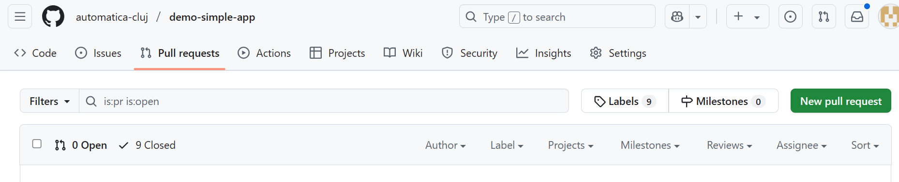
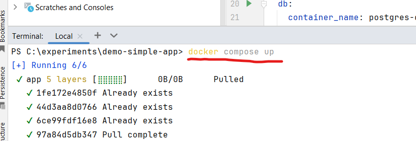

### GitHub Actions 

#### Ce sunt GitHub Actions?

GitHub Actions este o platformă integrată în GitHub care permite automatizarea fluxurilor de lucru (workflows) pentru dezvoltarea software-ului. Prin definirea unor fișiere YAML în directorul `.github/workflows`, poți configura procese automate declanșate de evenimente precum push-uri de cod, pull request-uri sau crearea de release-uri. Aceste fluxuri pot include pași precum compilarea aplicației, generarea de binare sau construirea și publicarea imaginilor Docker.

#### Despre repository-ul `demo-simple-app`

Repository-ul [automatica-cluj/demo-simple-app](https://github.com/automatica-cluj/demo-simple-app) este conceput pentru a demonstra cum o aplicație Java simplă poate fi construită, împachetată și distribuită ca imagine Docker utilizând GitHub Actions și GitHub Container Registry. Acest repository servește ca exemplu practic pentru automatizarea procesului de release, de la compilare până la generarea și publicarea imaginilor Docker.

#### Procesul de Release


Această secțiune descrie procesul formal de release al proiectului, utilizând GitHub Actions și GitHub Container Registry.

##### 1. Strategia de branching și pregătire
- Dezvoltarea aplicației se realizează pe ramura `main`.
- Când este necesară o nouă versiune (release), ramura `main` este combinată (merged) în ramura `release` pentru a asigura că cele mai recente modificări stabile sunt incluse.

##### 2. Configurarea GitHub Actions
- Un flux de lucru GitHub Actions este definit în fișierul `.github/workflows/docker-image.yml`.
- Acest flux monitorizează ramura `release` și este declanșat automat la modificări pe această ramură.
- Pașii fluxului includ:
    - Construirea aplicației Java folosind Maven.
    - Generarea binarului aplicației.
    - Crearea unei imagini Docker utilizând fișierul `Dockerfile` din rădăcina repository-ului.
    - Publicarea imaginii Docker în GitHub Container Registry.

##### Inițierea procesului de release
Procesul formal de release urmează acești pași:
1. **Merge `main` în `release`**:
    - Combină ramura `main` în `release` pentru a include cele mai recente modificări.

2. **Crearea unui release pe GitHub**:
    - Accesează secțiunea „Releases” din repository.
    - Apasă pe „Create new release”.
    - Configurează release-ul:
        - **Tag-ul release-ului**: Atribuie un tag de versiune (ex. `v1.0`). **Notă**: Tag-ul trebuie să înceapă cu „v”, deoarece acțiunea Docker GitHub este configurată să detecteze tag-uri cu acest format.
        - **Titlu și descriere**: Adaugă un titlu și o descriere care să rezume modificările cheie.
    - Apasă „Publish Release” pentru a finaliza procesul.
    - Această acțiune declanșează automat fluxul GitHub Actions pentru construirea imaginii Docker.
   - Monitorizează procesul de construire în tab-ul „Actions” al repository-ului.
3. **Verificare**:
    - Verifică tab-ul „Actions” pentru a te asigura că fluxul Docker s-a încheiat cu succes și imaginea a fost generată și publicată în GitHub Container Registry.


##### Screenshot-uri realizare pasi

->

->

->

->

->

->

->

->

->

->

->

->

->

->


##### Rularea aplicației utilizând imaginea Docker

- Actualizează fișierul `docker-compose.yaml` cu versiunea dorită și cu utilizatorul/repository-ul tău. Exemplu:
```yaml
services:
  app:
    container_name: springboot-app
    image: ghcr.io/automatica-cluj/demo-simple-app:v0.6-beta
```
- Rulează aplicația folosind Docker Compose:
```bash
docker compose up
```
- Testează controller-ul de bază „hello”:
```bash
curl http://localhost:8080/hello
```

###### Screenshot-uri rulare aplicație 

->

-> 

->

->


#### Referințe
- [GitHub Container Registry](https://docs.github.com/en/packages/working-with-a-github-packages-registry/working-with-the-container-registry)
- [Dockerfile Support for GitHub Actions](https://docs.github.com/en/actions/sharing-automations/creating-actions/dockerfile-support-for-github-actions)
- [Managing Releases](https://docs.github.com/en/repositories/releasing-projects-on-github/managing-releases-in-a-repository)
- [Publishing a Docker Image to GitHub Container Registry](https://dev.to/github/publishing-a-docker-image-to-githubs-container-repository-4n50)
- [Blog Codecentric despre GitHub Container Registry](https://www.codecentric.de/wissens-hub/blog/github-container-registry)
