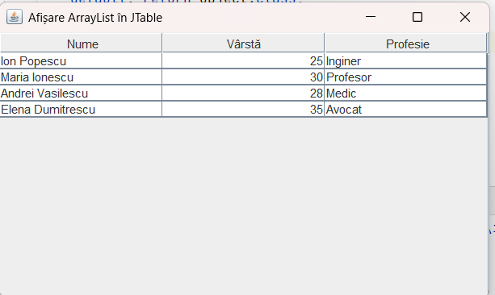

# Afișarea datelor dintr-un ArrayList într-un tabel Java Swing

Această documentație prezintă modul în care puteți afișa datele dintr-un ArrayList într-un tabel Java folosind biblioteca Swing.

## Definiția clasei pentru date

Mai întâi, vom defini o clasă pentru stocarea datelor noastre:

```java
public class Persoana {
    private String nume;
    private int varsta;
    private String profesie;
    
    public Persoana(String nume, int varsta, String profesie) {
        this.nume = nume;
        this.varsta = varsta;
        this.profesie = profesie;
    }
    
    public String getNume() {
        return nume;
    }
    
    public int getVarsta() {
        return varsta;
    }
    
    public String getProfesie() {
        return profesie;
    }
}
```

## Crearea unui ArrayList și popularea cu date

```java
import java.util.ArrayList;

// Crearea listei
ArrayList<Persoana> listaPersone = new ArrayList<>();

// Adăugarea datelor în listă
listaPersone.add(new Persoana("Ion Popescu", 25, "Inginer"));
listaPersone.add(new Persoana("Maria Ionescu", 30, "Profesor"));
listaPersone.add(new Persoana("Andrei Vasilescu", 28, "Medic"));
listaPersone.add(new Persoana("Elena Dumitrescu", 35, "Avocat"));
```

## Afișarea datelor din ArrayList într-un JTable

Există două abordări principale pentru afișarea datelor dintr-un ArrayList într-un JTable:

### Abordarea 1: Utilizarea unui DefaultTableModel

Aceasta este abordarea cea mai simplă și directă:

```java
import javax.swing.*;
import javax.swing.table.*;
import java.util.ArrayList;

public class ExempluTabelArrayList {
    public static void main(String[] args) {
        // Crearea și popularea ArrayList-ului
        ArrayList<Persoana> listaPersone = new ArrayList<>();
        listaPersone.add(new Persoana("Ion Popescu", 25, "Inginer"));
        listaPersone.add(new Persoana("Maria Ionescu", 30, "Profesor"));
        listaPersone.add(new Persoana("Andrei Vasilescu", 28, "Medic"));
        listaPersone.add(new Persoana("Elena Dumitrescu", 35, "Avocat"));
        
        // Definirea numelor coloanelor
        String[] numeColoane = {"Nume", "Vârstă", "Profesie"};
        
        // Crearea modelului de tabel
        DefaultTableModel model = new DefaultTableModel(numeColoane, 0);
        
        // Popularea modelului cu date din ArrayList
        for (Persoana persoana : listaPersone) {
            Object[] rand = {
                persoana.getNume(),
                persoana.getVarsta(),
                persoana.getProfesie()
            };
            model.addRow(rand);
        }
        
        // Crearea tabelului cu modelul de date
        JTable tabel = new JTable(model);
        
        // Adăugarea tabelului într-un JScrollPane pentru a permite derularea
        JScrollPane scrollPane = new JScrollPane(tabel);
        
        // Crearea și configurarea ferestrei
        JFrame fereastra = new JFrame("Afișare ArrayList în JTable");
        fereastra.setDefaultCloseOperation(JFrame.EXIT_ON_CLOSE);
        fereastra.add(scrollPane);
        fereastra.setSize(500, 300);
        fereastra.setVisible(true);
    }
}
```



### Abordarea 2: Crearea unui TableModel personalizat

Această abordare este puțin mai complexă, dar oferă un control mai mare asupra modului în care datele sunt afișate:

```java
import javax.swing.*;
import javax.swing.table.*;
import java.util.ArrayList;

public class ExempluTabelArrayListPersonalizat {
    public static void main(String[] args) {
        // Crearea și popularea ArrayList-ului
        ArrayList<Persoana> listaPersone = new ArrayList<>();
        listaPersone.add(new Persoana("Ion Popescu", 25, "Inginer"));
        listaPersone.add(new Persoana("Maria Ionescu", 30, "Profesor"));
        listaPersone.add(new Persoana("Andrei Vasilescu", 28, "Medic"));
        listaPersone.add(new Persoana("Elena Dumitrescu", 35, "Avocat"));
        
        // Crearea unui model de tabel personalizat
        PersoanaTableModel model = new PersoanaTableModel(listaPersone);
        
        // Crearea tabelului cu modelul de date
        JTable tabel = new JTable(model);
        
        // Adăugarea tabelului într-un JScrollPane pentru a permite derularea
        JScrollPane scrollPane = new JScrollPane(tabel);
        
        // Crearea și configurarea ferestrei
        JFrame fereastra = new JFrame("Afișare ArrayList în JTable");
        fereastra.setDefaultCloseOperation(JFrame.EXIT_ON_CLOSE);
        fereastra.add(scrollPane);
        fereastra.setSize(500, 300);
        fereastra.setVisible(true);
    }
    
    // Clasa pentru modelul de tabel personalizat
    static class PersoanaTableModel extends AbstractTableModel {
        private final String[] numeColoane = {"Nume", "Vârstă", "Profesie"};
        private ArrayList<Persoana> listaPersone;
        
        public PersoanaTableModel(ArrayList<Persoana> listaPersone) {
            this.listaPersone = listaPersone;
        }
        
        @Override
        public int getRowCount() {
            return listaPersone.size();
        }
        
        @Override
        public int getColumnCount() {
            return numeColoane.length;
        }
        
        @Override
        public Object getValueAt(int row, int col) {
            Persoana persoana = listaPersone.get(row);
            
            switch (col) {
                case 0: return persoana.getNume();
                case 1: return persoana.getVarsta();
                case 2: return persoana.getProfesie();
                default: return null;
            }
        }
        
        @Override
        public String getColumnName(int col) {
            return numeColoane[col];
        }
        
        @Override
        public Class<?> getColumnClass(int col) {
            switch (col) {
                case 0: return String.class;
                case 1: return Integer.class;
                case 2: return String.class;
                default: return Object.class;
            }
        }
    }
}
```

## Observații

1. Modelul de tabel (`TableModel`) este interfața prin care JTable interacționează cu datele.
2. `DefaultTableModel` este o implementare simplă a acestei interfețe care permite adăugarea și ștergerea rândurilor.
3. În exemplul cu `AbstractTableModel`, avem control deplin asupra modului în care datele sunt afișate și tipurilor de date pentru fiecare coloană.
4. Pentru liste simple, `DefaultTableModel` este de obicei suficient, iar pentru cazuri mai complexe, se recomandă crearea unui model personalizat.
