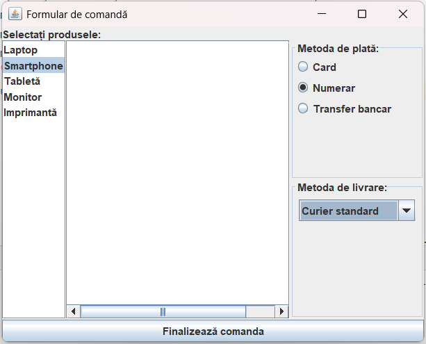

# Documentație Java Swing: JList, JComboBox și JRadioButton

## Cuprins
1. [Introducere](#introducere)
2. [JList](#jlist)
   - [Crearea unui JList](#crearea-unui-jlist)
   - [Adăugarea elementelor](#adăugarea-elementelor)
   - [Gestionarea selecțiilor](#gestionarea-selecțiilor)
   - [Ascultători de evenimente](#ascultători-de-evenimente-jlist)
   - [Exemplu complet](#exemplu-complet-jlist)
3. [JComboBox](#jcombobox)
   - [Crearea unui JComboBox](#crearea-unui-jcombobox)
   - [Adăugarea și eliminarea elementelor](#adăugarea-și-eliminarea-elementelor)
   - [Gestionarea selecțiilor](#gestionarea-selecțiilor-combobox)
   - [Ascultători de evenimente](#ascultători-de-evenimente-combobox)
   - [Exemplu complet](#exemplu-complet-combobox)
4. [JRadioButton](#jradiobutton)
   - [Crearea unui JRadioButton](#crearea-unui-jradiobutton)
   - [Gruparea butoanelor radio](#gruparea-butoanelor-radio)
   - [Gestionarea selecțiilor](#gestionarea-selecțiilor-radiobutton)
   - [Ascultători de evenimente](#ascultători-de-evenimente-radiobutton)
   - [Exemplu complet](#exemplu-complet-radiobutton)
5. [Utilizarea componentelor împreună](#utilizarea-componentelor-împreună)

## Introducere

Java Swing oferă mai multe componente pentru afișarea și selectarea opțiunilor. În această documentație, vom explora trei dintre cele mai utilizate:
- **JList**: Afișează o listă de elemente din care utilizatorul poate selecta unul sau mai multe
- **JComboBox**: Afișează o listă verticală drop-down pentru selectarea unui singur element
- **JRadioButton**: Permite utilizatorului să selecteze o singură opțiune dintr-un grup de opțiuni

## JList

`JList` este o componentă care afișează o listă de elemente, permițând utilizatorului să selecteze unul sau mai multe dintre acestea.

### Crearea unui JList

```java
// Crearea unui JList simplu
JList<String> lista = new JList<>();

// Crearea unui JList cu un vector de elemente
String[] elemente = {"Element 1", "Element 2", "Element 3"};
JList<String> lista = new JList<>(elemente);

// Crearea unui JList cu un model DefaultListModel
DefaultListModel<String> model = new DefaultListModel<>();
model.addElement("Element 1");
model.addElement("Element 2");
model.addElement("Element 3");
JList<String> lista = new JList<>(model);
```

### Adăugarea elementelor

Pentru a gestiona dinamic elementele unui JList, este recomandat să folosiți un `DefaultListModel`:

```java
DefaultListModel<String> model = new DefaultListModel<>();
JList<String> lista = new JList<>(model);

// Adăugarea elementelor
model.addElement("Element 1");
model.addElement("Element 2");

// Inserarea unui element la un index specific
model.add(1, "Element nou");

// Eliminarea unui element după index
model.remove(0);

// Eliminarea unui element specific
model.removeElement("Element 2");

// Înlocuirea unui element
model.set(0, "Element înlocuit");
```

### Gestionarea selecțiilor

JList permite diferite moduri de selecție:

```java
// Setarea modului de selecție
lista.setSelectionMode(ListSelectionModel.SINGLE_SELECTION); // Doar un element
lista.setSelectionMode(ListSelectionModel.SINGLE_INTERVAL_SELECTION); // Interval continuu
lista.setSelectionMode(ListSelectionModel.MULTIPLE_INTERVAL_SELECTION); // Mai multe intervale (implicit)

// Obținerea elementelor selectate
int[] indici = lista.getSelectedIndices(); // Obține indicii selectați
List<String> elementeSelectate = lista.getSelectedValuesList(); // Obține valorile selectate
```

### Ascultători de evenimente JList

Pentru a reacționa la selectarea elementelor din JList:

```java
lista.addListSelectionListener(new ListSelectionListener() {
    @Override
    public void valueChanged(ListSelectionEvent e) {
        // Verificăm dacă evenimentul este final (nu este în desfășurare)
        if (!e.getValueIsAdjusting()) {
            String elementSelectat = lista.getSelectedValue();
            System.out.println("Element selectat: " + elementSelectat);
        }
    }
});
```

### Exemplu complet JList

```java
import javax.swing.*;
import javax.swing.event.ListSelectionEvent;
import javax.swing.event.ListSelectionListener;
import java.awt.*;

public class ExempluJList {
    public static void main(String[] args) {
        JFrame frame = new JFrame("Exemplu JList");
        frame.setDefaultCloseOperation(JFrame.EXIT_ON_CLOSE);
        frame.setSize(300, 200);
        
        DefaultListModel<String> model = new DefaultListModel<>();
        model.addElement("București");
        model.addElement("Cluj-Napoca");
        model.addElement("Timișoara");
        model.addElement("Iași");
        model.addElement("Constanța");
        
        JList<String> lista = new JList<>(model);
        lista.setSelectionMode(ListSelectionModel.SINGLE_SELECTION);
        JScrollPane scrollPane = new JScrollPane(lista);
        
        lista.addListSelectionListener(new ListSelectionListener() {
            @Override
            public void valueChanged(ListSelectionEvent e) {
                if (!e.getValueIsAdjusting()) {
                    JOptionPane.showMessageDialog(frame, 
                            "Ați selectat: " + lista.getSelectedValue());
                }
            }
        });
        
        frame.add(scrollPane, BorderLayout.CENTER);
        frame.setVisible(true);
    }
}
```

## JComboBox

`JComboBox` este o componentă care combină un câmp text și o listă drop-down, permițând selectarea unui singur element din listă.

### Crearea unui JComboBox

```java
// Crearea unui JComboBox gol
JComboBox<String> combo = new JComboBox<>();

// Crearea unui JComboBox cu un vector de elemente
String[] elemente = {"Element 1", "Element 2", "Element 3"};
JComboBox<String> combo = new JComboBox<>(elemente);

// Crearea unui JComboBox cu un model DefaultComboBoxModel
DefaultComboBoxModel<String> model = new DefaultComboBoxModel<>();
model.addElement("Element 1");
model.addElement("Element 2");
JComboBox<String> combo = new JComboBox<>(model);
```

### Adăugarea și eliminarea elementelor

```java
JComboBox<String> combo = new JComboBox<>();

// Adăugarea elementelor
combo.addItem("Element 1");
combo.addItem("Element 2");

// Inserarea unui element la un index specific
combo.insertItemAt("Element nou", 1);

// Eliminarea unui element după index
combo.removeItemAt(0);

// Eliminarea unui element specific
combo.removeItem("Element 2");
```

### Gestionarea selecțiilor ComboBox

```java
// Selectarea unui element după index
combo.setSelectedIndex(1);

// Selectarea unui element după valoare
combo.setSelectedItem("Element 2");

// Obținerea elementului selectat
String elementSelectat = (String) combo.getSelectedItem();
int indexSelectat = combo.getSelectedIndex();
```

### Ascultători de evenimente ComboBox

```java
combo.addActionListener(new ActionListener() {
    @Override
    public void actionPerformed(ActionEvent e) {
        String elementSelectat = (String) combo.getSelectedItem();
        System.out.println("Element selectat: " + elementSelectat);
    }
});
```

### Exemplu complet ComboBox

```java
import javax.swing.*;
import java.awt.*;
import java.awt.event.ActionEvent;
import java.awt.event.ActionListener;

public class ExempluJComboBox {
    public static void main(String[] args) {
        JFrame frame = new JFrame("Exemplu JComboBox");
        frame.setDefaultCloseOperation(JFrame.EXIT_ON_CLOSE);
        frame.setSize(300, 150);
        frame.setLayout(new FlowLayout());
        
        String[] limbaje = {"Java", "Python", "C++", "JavaScript", "C#"};
        JComboBox<String> combo = new JComboBox<>(limbaje);
        
        JLabel rezultat = new JLabel("Niciun limbaj selectat");
        
        combo.addActionListener(new ActionListener() {
            @Override
            public void actionPerformed(ActionEvent e) {
                rezultat.setText("Limbaj selectat: " + combo.getSelectedItem());
            }
        });
        
        frame.add(new JLabel("Selectați un limbaj de programare:"));
        frame.add(combo);
        frame.add(rezultat);
        
        frame.setVisible(true);
    }
}
```

## JRadioButton

`JRadioButton` permite utilizatorului să selecteze o singură opțiune dintr-un grup de opțiuni.

### Crearea unui JRadioButton

```java
// Crearea butoanelor radio
JRadioButton radioButon1 = new JRadioButton("Opțiunea 1");
JRadioButton radioButon2 = new JRadioButton("Opțiunea 2");
JRadioButton radioButon3 = new JRadioButton("Opțiunea 3");

// Setarea unui buton ca fiind selectat implicit
radioButon1.setSelected(true);
```

### Gruparea butoanelor radio

Pentru a asigura selecția exclusivă (doar un buton poate fi selectat la un moment dat), trebuie să adăugați butoanele radio într-un `ButtonGroup`:

```java
// Crearea unui grup de butoane
ButtonGroup grup = new ButtonGroup();

// Adăugarea butoanelor în grup
grup.add(radioButon1);
grup.add(radioButon2);
grup.add(radioButon3);
```

### Gestionarea selecțiilor RadioButton

```java
// Verificarea dacă un buton este selectat
boolean esteSelectat = radioButon1.isSelected();

// Setarea unui buton ca fiind selectat
radioButon2.setSelected(true);
```

### Ascultători de evenimente RadioButton

```java
radioButon1.addActionListener(new ActionListener() {
    @Override
    public void actionPerformed(ActionEvent e) {
        System.out.println("Opțiunea 1 a fost selectată");
    }
});
```

### Exemplu complet RadioButton

```java
import javax.swing.*;
import java.awt.*;
import java.awt.event.ActionEvent;
import java.awt.event.ActionListener;

public class ExempluJRadioButton {
    public static void main(String[] args) {
        JFrame frame = new JFrame("Exemplu JRadioButton");
        frame.setDefaultCloseOperation(JFrame.EXIT_ON_CLOSE);
        frame.setSize(300, 200);
        frame.setLayout(new FlowLayout());
        
        // Crearea butoanelor radio
        JRadioButton radioMasculin = new JRadioButton("Masculin");
        JRadioButton radioFeminin = new JRadioButton("Feminin");
        JRadioButton radioAltul = new JRadioButton("Altul");
        
        // Setarea unui buton ca fiind selectat implicit
        radioMasculin.setSelected(true);
        
        // Gruparea butoanelor radio
        ButtonGroup grupGen = new ButtonGroup();
        grupGen.add(radioMasculin);
        grupGen.add(radioFeminin);
        grupGen.add(radioAltul);
        
        // Crearea unui panou pentru afișarea rezultatului
        JLabel rezultat = new JLabel("Gen selectat: Masculin");
        
        // Adăugarea ascultătorilor de evenimente
        ActionListener listener = new ActionListener() {
            @Override
            public void actionPerformed(ActionEvent e) {
                JRadioButton buton = (JRadioButton) e.getSource();
                rezultat.setText("Gen selectat: " + buton.getText());
            }
        };
        
        radioMasculin.addActionListener(listener);
        radioFeminin.addActionListener(listener);
        radioAltul.addActionListener(listener);
        
        // Adăugarea componentelor în frame
        JPanel panel = new JPanel();
        panel.setBorder(BorderFactory.createTitledBorder("Selectați genul:"));
        panel.setLayout(new BoxLayout(panel, BoxLayout.Y_AXIS));
        panel.add(radioMasculin);
        panel.add(radioFeminin);
        panel.add(radioAltul);
        
        frame.add(panel);
        frame.add(rezultat);
        
        frame.setVisible(true);
    }
}
```

## Utilizarea componentelor împreună

Aceste componente pot fi utilizate împreună pentru a crea interfețe complexe. Iată un exemplu care combină toate cele trei componente:

```java
import javax.swing.*;
import javax.swing.event.ListSelectionEvent;
import javax.swing.event.ListSelectionListener;
import java.awt.*;
import java.awt.event.ActionEvent;
import java.awt.event.ActionListener;

public class ComponenteCombinate {
    public static void main(String[] args) {
        JFrame frame = new JFrame("Formular de comandă");
        frame.setDefaultCloseOperation(JFrame.EXIT_ON_CLOSE);
        frame.setSize(500, 400);
        frame.setLayout(new BorderLayout());
        
        // Panou pentru produse (JList)
        DefaultListModel<String> modelProduse = new DefaultListModel<>();
        modelProduse.addElement("Laptop");
        modelProduse.addElement("Smartphone");
        modelProduse.addElement("Tabletă");
        modelProduse.addElement("Monitor");
        modelProduse.addElement("Imprimantă");
        
        JList<String> listaProduse = new JList<>(modelProduse);
        listaProduse.setSelectionMode(ListSelectionModel.MULTIPLE_INTERVAL_SELECTION);
        JScrollPane scrollPane = new JScrollPane(listaProduse);
        
        // Panou pentru metoda de plată (JRadioButton)
        JPanel panouPlata = new JPanel();
        panouPlata.setBorder(BorderFactory.createTitledBorder("Metoda de plată:"));
        panouPlata.setLayout(new BoxLayout(panouPlata, BoxLayout.Y_AXIS));
        
        JRadioButton radioCard = new JRadioButton("Card");
        JRadioButton radioCash = new JRadioButton("Numerar");
        JRadioButton radioTransfer = new JRadioButton("Transfer bancar");
        
        ButtonGroup grupPlata = new ButtonGroup();
        grupPlata.add(radioCard);
        grupPlata.add(radioCash);
        grupPlata.add(radioTransfer);
        radioCard.setSelected(true);
        
        panouPlata.add(radioCard);
        panouPlata.add(radioCash);
        panouPlata.add(radioTransfer);
        
        // Panou pentru livrare (JComboBox)
        JPanel panouLivrare = new JPanel();
        panouLivrare.setBorder(BorderFactory.createTitledBorder("Metoda de livrare:"));
        
        String[] metode = {"Curier standard", "Curier rapid", "Ridicare personală"};
        JComboBox<String> comboLivrare = new JComboBox<>(metode);
        panouLivrare.add(comboLivrare);
        
        // Panou pentru opțiuni și rezultat
        JPanel panouOptiuni = new JPanel(new GridLayout(2, 1));
        panouOptiuni.add(panouPlata);
        panouOptiuni.add(panouLivrare);
        
        JTextArea rezultat = new JTextArea(8, 30);
        rezultat.setEditable(false);
        
        // Buton pentru finalizare
        JButton butonFinalizare = new JButton("Finalizează comanda");
        butonFinalizare.addActionListener(new ActionListener() {
            @Override
            public void actionPerformed(ActionEvent e) {
                StringBuilder sb = new StringBuilder();
                sb.append("COMANDĂ FINALIZATĂ\n\n");
                
                sb.append("Produse selectate:\n");
                for (String produs : listaProduse.getSelectedValuesList()) {
                    sb.append("- ").append(produs).append("\n");
                }
                
                sb.append("\nMetoda de plată: ");
                if (radioCard.isSelected()) sb.append("Card");
                else if (radioCash.isSelected()) sb.append("Numerar");
                else sb.append("Transfer bancar");
                
                sb.append("\nMetoda de livrare: ").append(comboLivrare.getSelectedItem());
                
                rezultat.setText(sb.toString());
            }
        });
        
        // Adăugarea componentelor în frame
        frame.add(new JLabel("Selectați produsele:"), BorderLayout.NORTH);
        frame.add(scrollPane, BorderLayout.WEST);
        frame.add(panouOptiuni, BorderLayout.EAST);
        frame.add(new JScrollPane(rezultat), BorderLayout.CENTER);
        frame.add(butonFinalizare, BorderLayout.SOUTH);
        
        frame.setVisible(true);
    }
}
```


Acest exemplu creează un formular de comandă simplu, care utilizează:
- Un `JList` pentru selectarea produselor
- Butoane `JRadioButton` pentru alegerea metodei de plată
- Un `JComboBox` pentru selectarea metodei de livrare
