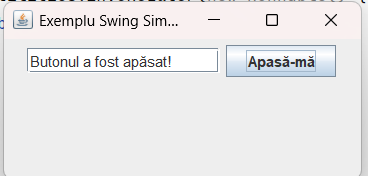

# Pașii de bază pentru crearea unei interfețe grafice în Java Swing

## Etapele principale

### 1. Importul bibliotecilor necesare
```java
import javax.swing.*;
import java.awt.*;
import java.awt.event.*;
```

### 2. Crearea ferestrei principale
```java
JFrame fereastra = new JFrame("Titlul ferestrei");
fereastra.setSize(300, 200);
fereastra.setDefaultCloseOperation(JFrame.EXIT_ON_CLOSE);
```

### 3. Crearea componentelor
```java
JButton buton = new JButton("Apasă");
JTextField campText = new JTextField(15);
```

### 4. Adăugarea gestionării evenimentelor
```java
buton.addActionListener(new ActionListener() {
    public void actionPerformed(ActionEvent e) {
        // cod executat la apăsarea butonului
        campText.setText("Buton apăsat!");
    }
});
```

### 5. Organizarea componentelor cu un manager de layout
```java
JPanel panel = new JPanel();
panel.setLayout(new FlowLayout());
panel.add(campText);
panel.add(buton);
```

### 6. Adăugarea componentelor în fereastră
```java
fereastra.add(panel);
```

### 7. Afișarea ferestrei
```java
fereastra.setLocationRelativeTo(null); // centrare pe ecran
fereastra.setVisible(true);
```

### 8. Executarea în Event Dispatch Thread
```java
public static void main(String[] args) {
    SwingUtilities.invokeLater(new Runnable() {
        public void run() {
            // crearea și afișarea interfeței
        }
    });
}
```

## Codul sursă complet

Iată codul sursă complet al unui exemplu simplu cu buton și câmp text:

```java
import javax.swing.*;
import java.awt.*;
import java.awt.event.*;

public class ExempluSwing extends JFrame {
    private JTextField textField;
    private JButton buton;
    
    public ExempluSwing() {
        // Configurare fereastră
        setTitle("Exemplu Swing Simplu");
        setSize(300, 150);
        setDefaultCloseOperation(JFrame.EXIT_ON_CLOSE);
        setLocationRelativeTo(null);
        
        // Creare componente
        textField = new JTextField(15);
        buton = new JButton("Apasă-mă");
        
        // Adăugare action listener pentru buton
        buton.addActionListener(new ActionListener() {
            public void actionPerformed(ActionEvent e) {
                textField.setText("Butonul a fost apăsat!");
            }
        });
        
        // Creare panel și adăugare componente
        JPanel panel = new JPanel();
        panel.setLayout(new FlowLayout());
        panel.add(textField);
        panel.add(buton);
        
        // Adăugare panel la fereastră
        add(panel);
        
        // Afișare fereastră
        setVisible(true);
    }
    
    public static void main(String[] args) {
        // Creare instanță a ferestrei
        SwingUtilities.invokeLater(new Runnable() {
            public void run() {
                new ExempluSwing();
            }
        });
    }
}
```
