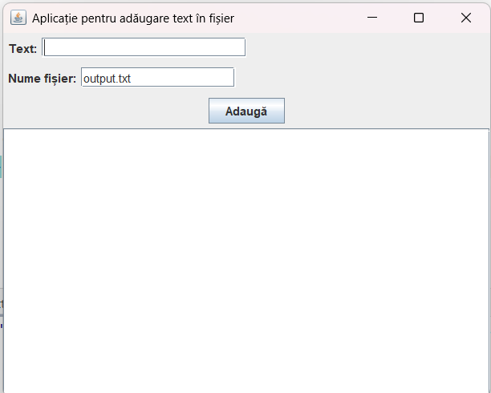

# Aplicație Java Swing pentru adăugarea textului în fișier și afișarea conținutului

Această aplicație permite utilizatorului să introducă text într-un TextField, să specifice numele unui fișier, și să adauge textul respectiv în fișier prin apăsarea unui buton. În plus, fiecare linie adăugată este afișată într-un TextArea.

## Structura aplicației

Aplicația are următoarele componente principale:
- Un TextField pentru introducerea textului
- Un TextField pentru specificarea numelui fișierului
- Un buton "Adaugă" pentru a adăuga textul în fișier
- Un TextArea pentru afișarea liniilor adăugate în fișier

## Pașii de implementare

### 1. Importul bibliotecilor necesare
```java
import javax.swing.*;
import java.awt.*;
import java.awt.event.*;
import java.io.*;
```

### 2. Definirea clasei principale
```java
public class FileTextApp extends JFrame {
    private JTextField inputTextField;
    private JTextField fileNameTextField;
    private JTextArea displayTextArea;
    private JButton addButton;
    
    // Constructor și metoda main
}
```

### 3. Crearea componentelor UI
```java
public FileTextApp() {
    // Configurare fereastră
    setTitle("Aplicație pentru adăugare text în fișier");
    setSize(500, 400);
    setDefaultCloseOperation(JFrame.EXIT_ON_CLOSE);
    setLocationRelativeTo(null);
    
    // Inițializare componente
    JLabel textLabel = new JLabel("Text:");
    inputTextField = new JTextField(20);
    
    JLabel fileLabel = new JLabel("Nume fișier:");
    fileNameTextField = new JTextField("output.txt", 15);
    
    addButton = new JButton("Adaugă");
    
    displayTextArea = new JTextArea(15, 40);
    displayTextArea.setEditable(false); // Făcut doar pentru citire
    JScrollPane scrollPane = new JScrollPane(displayTextArea); // Adăugare scroll
}
```

### 4. Organizarea componentelor în layout
```java
// Panel superior pentru input și nume fișier
JPanel topPanel = new JPanel(new FlowLayout());
topPanel.add(textLabel);
topPanel.add(inputTextField);
topPanel.add(fileLabel);
topPanel.add(fileNameTextField);
topPanel.add(addButton);

// Organizare generală
setLayout(new BorderLayout());
add(topPanel, BorderLayout.NORTH);
add(scrollPane, BorderLayout.CENTER);
```

### 5. Adăugarea funcționalității butonului
```java
addButton.addActionListener(new ActionListener() {
    public void actionPerformed(ActionEvent e) {
        addTextToFile();
    }
});
```

### 6. Implementarea metodei pentru adăugarea textului în fișier
```java
private void addTextToFile() {
    String text = inputTextField.getText().trim();
    String fileName = fileNameTextField.getText().trim();
    
    if (text.isEmpty()) {
        JOptionPane.showMessageDialog(this, "Te rog introdu un text!", 
                                     "Eroare", JOptionPane.ERROR_MESSAGE);
        return;
    }
    
    if (fileName.isEmpty()) {
        JOptionPane.showMessageDialog(this, "Te rog specifică un nume pentru fișier!", 
                                     "Eroare", JOptionPane.ERROR_MESSAGE);
        return;
    }
    
    try {
        // Adăugare text în fișier (append mode)
        FileWriter fileWriter = new FileWriter(fileName, true);
        BufferedWriter bufferedWriter = new BufferedWriter(fileWriter);
        
        bufferedWriter.write(text);
        bufferedWriter.newLine();
        bufferedWriter.close();
        
        // Adăugare text în TextArea
        displayTextArea.append(text + "\n");
        
        // Golire TextField pentru introducerea unui text nou
        inputTextField.setText("");
        inputTextField.requestFocus();
        
    } catch (IOException ex) {
        JOptionPane.showMessageDialog(this, 
            "Eroare la scrierea în fișier: " + ex.getMessage(), 
            "Eroare", JOptionPane.ERROR_MESSAGE);
    }
}
```

### 7. Metoda main pentru lansarea aplicației
```java
public static void main(String[] args) {
    SwingUtilities.invokeLater(new Runnable() {
        public void run() {
            new FileTextApp().setVisible(true);
        }
    });
}
```

## Codul complet al aplicației

```java
package utcluj.aut;

import javax.swing.*;
import java.awt.*;
import java.awt.event.*;
import java.io.*;

public class FileTextApp extends JFrame {
   private JTextField inputTextField;
   private JTextField fileNameTextField;
   private JTextArea displayTextArea;
   private JButton addButton;

   public FileTextApp() {
      // Configurare fereastră
      setTitle("Aplicație pentru adăugare text în fișier");
      setSize(500, 400);
      setDefaultCloseOperation(JFrame.EXIT_ON_CLOSE);
      setLocationRelativeTo(null);

      // Inițializare componente
      JLabel textLabel = new JLabel("Text:");
      inputTextField = new JTextField(20);

      JLabel fileLabel = new JLabel("Nume fișier:");
      fileNameTextField = new JTextField("output.txt", 15);

      addButton = new JButton("Adaugă");

      displayTextArea = new JTextArea(15, 40);
      displayTextArea.setEditable(false); // Făcut doar pentru citire
      JScrollPane scrollPane = new JScrollPane(displayTextArea); // Adăugare scroll

      // Organizarea componentelor folosind layout managers standard
      // Panel pentru textField și label
      JPanel textPanel = new JPanel(new FlowLayout(FlowLayout.LEFT));
      textPanel.add(textLabel);
      textPanel.add(inputTextField);

      // Panel pentru fileName și label
      JPanel filePanel = new JPanel(new FlowLayout(FlowLayout.LEFT));
      filePanel.add(fileLabel);
      filePanel.add(fileNameTextField);

      // Panel pentru buton, centrat
      JPanel buttonPanel = new JPanel(new FlowLayout(FlowLayout.CENTER));
      buttonPanel.add(addButton);

      // Panel principal pentru input-uri folosind BoxLayout vertical
      JPanel topPanel = new JPanel();
      topPanel.setLayout(new BoxLayout(topPanel, BoxLayout.Y_AXIS));
      topPanel.add(textPanel);
      topPanel.add(filePanel);
      topPanel.add(buttonPanel);

      // Organizare generală
      setLayout(new BorderLayout());
      add(topPanel, BorderLayout.NORTH);
      add(scrollPane, BorderLayout.CENTER);

      // Adăugare acțiune buton
      addButton.addActionListener(new ActionListener() {
         public void actionPerformed(ActionEvent e) {
            addTextToFile();
         }
      });

      // Adăugare listener pentru tastă Enter în inputTextField
      inputTextField.addKeyListener(new KeyAdapter() {
         public void keyPressed(KeyEvent e) {
            if (e.getKeyCode() == KeyEvent.VK_ENTER) {
               addTextToFile();
            }
         }
      });
   }

   private void addTextToFile() {
      String text = inputTextField.getText().trim();
      String fileName = fileNameTextField.getText().trim();

      if (text.isEmpty()) {
         JOptionPane.showMessageDialog(this, "Te rog introdu un text!",
                 "Eroare", JOptionPane.ERROR_MESSAGE);
         return;
      }

      if (fileName.isEmpty()) {
         JOptionPane.showMessageDialog(this, "Te rog specifică un nume pentru fișier!",
                 "Eroare", JOptionPane.ERROR_MESSAGE);
         return;
      }

      try {
         // Adăugare text în fișier (append mode)
         FileWriter fileWriter = new FileWriter(fileName, true);
         BufferedWriter bufferedWriter = new BufferedWriter(fileWriter);

         bufferedWriter.write(text);
         bufferedWriter.newLine();
         bufferedWriter.close();

         // Adăugare text în TextArea
         displayTextArea.append(text + "\n");

         // Golire TextField pentru introducerea unui text nou
         inputTextField.setText("");
         inputTextField.requestFocus();

      } catch (IOException ex) {
         JOptionPane.showMessageDialog(this,
                 "Eroare la scrierea în fișier: " + ex.getMessage(),
                 "Eroare", JOptionPane.ERROR_MESSAGE);
      }
   }

   public static void main(String[] args) {
      SwingUtilities.invokeLater(new Runnable() {
         public void run() {
            new FileTextApp().setVisible(true);
         }
      });
   }
}
```



## Explicații suplimentare

1. **Componente importante**:
    - `JTextField inputTextField`: Pentru introducerea textului de adăugat
    - `JTextField fileNameTextField`: Pentru specificarea numelui fișierului
    - `JTextArea displayTextArea`: Pentru afișarea liniilor adăugate
    - `JButton addButton`: Pentru declanșarea acțiunii de adăugare

2. **Operații cu fișiere**:
    - Aplicația folosește `FileWriter` și `BufferedWriter` pentru a scrie în fișier
    - Parametrul `true` la constructorul `FileWriter` activează modul append (adăugare), ceea ce înseamnă că textul nou este adăugat la sfârșitul fișierului existent

3. **Funcționalități suplimentare**:
    - Aplicația permite și folosirea tastei Enter pentru adăugare rapidă
    - Sunt implementate verificări pentru text și nume de fișier goale
    - După adăugare, câmpul de text este golit și focusul este setat înapoi pe el pentru a facilita introducerea rapidă a mai multor linii

4. **JScrollPane**:
    - TextArea este plasat într-un JScrollPane pentru a permite derularea când conținutul depășește dimensiunea vizibilă

5. **Gestionarea erorilor**:
    - Erorile la scrierea în fișier sunt prinse și afișate utilizatorului într-un dialog de eroare