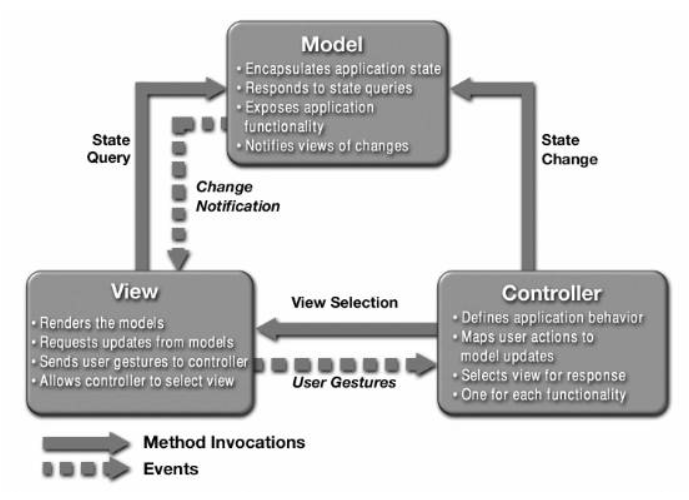

# Model-View-Controller (MVC)

## Introducere

Modelul arhitectural Model-View-Controller (MVC) reprezintă unul dintre cele mai populare și eficiente șabloane de proiectare utilizate în dezvoltarea aplicațiilor cu interfețe grafice. Acest model facilitează organizarea codului prin separarea clară a responsabilităților între diferite componente ale aplicației.

## Componente principale

MVC descompune obiectele aplicației în trei categorii distincte:

### 1. Model

Componenta **Model** are următoarele caracteristici și responsabilități:
- Menține starea curentă a aplicației, a unei părți a aplicației sau a unui set de date
- Poate desfășura anumite acțiuni specifice domeniului aplicației
- Nu conține nicio informație cu privire la reprezentarea datelor (modul în care informațiile vor fi afișate către utilizator)
- Oferă metode prin care poate fi interogat și modificat
- Implementează un mecanism prin care componentele de tip View pot fi înregistrate pentru a primi notificări
- Notifică toate componentele View înregistrate atunci când starea sa se modifică

### 2. View

Componenta **View** are următoarele caracteristici și responsabilități:
- Reprezintă interfața grafică ce reflectă starea curentă a unui Model
- Este responsabilă cu afișarea pe ecran a informațiilor
- Preia de la utilizator eventualele acțiuni
- Un Model poate avea înregistrate mai multe componente View
- Primește notificări când starea Modelului se schimbă și se actualizează corespunzător

### 3. Controller

Componenta **Controller** are următoarele caracteristici și responsabilități:
- Procesează și răspunde la evenimente
- Preia acțiunile utilizatorului
- Modifică starea componentei Model sau View conform acțiunilor utilizatorului
- Realizează legăturile dintre View-uri și Model
- Interpretează și traduce acțiunile utilizatorului în comenzi pentru Model

## Fluxul de date în MVC



Fluxul tipic de date în MVC funcționează astfel:

1. Un eveniment este captat de Controller (de obicei o acțiune a utilizatorului)
2. Controller-ul determină schimbarea componentei Model sau a componentei View
3. Când Controller-ul schimbă starea Modelului, toate componentele View sunt notificate automat
4. Componentele View își actualizează afișarea preluând datele necesare din Model
5. În mod similar, când Controller-ul schimbă o componentă View, aceasta extrage datele necesare din Model pentru a fi afișate

## Implementare în Java

Pentru implementarea modelului MVC în Java, se pot folosi clasa `java.util.Observable` și interfata `java.util.Observer`. Aceste două componente permit realizarea unui mecanism de notificare automată a obiectelor Observer atunci când se produce o schimbare în cadrul unui obiect Observable. Desi aceste doua clasa sunt deprecated în Java 9, ele sunt încă utilizate în aplicațiile existente și sunt utile pentru a înțelege conceptele de bază ale arhitecturii MVC. 

### Pași de implementare:

1. **Implementarea Modelului:**
  - Extindeți clasa `java.util.Observable`
  - Apelați metodele `setChanged()` și `notifyObservers()` pentru a notifica observatorii când starea modelului se modifică

2. **Implementarea View-urilor:**
  - Implementați interfața `java.util.Observer`
  - Implementați metoda `update(Observable o, Object arg)` pentru a reacționa la modificările modelului
  - Înregistrați View-urile ca observatori ai modelului

3. **Implementarea Controller-ului:**
  - Creați o clasă ce gestionează interacțiunea dintre Model și View
  - Implementați mecanisme pentru a prelua acțiunile utilizatorului și a le transmite modelului

## Exemplu 1: Aplicația Termometru

Exemplul următor prezintă o aplicație ce simulează un termometru care citește temperaturi din mediul înconjurător și le afișează atât în mod text, cât și grafic.

### Componenta Model: Clasa Thermometer

```java
import java.util.Observable; 
public class Thermometer extends Observable implements Runnable {
      static int MAX_VALUE=100;
      static int MIN_VALUE=0;
      double temp=30;
      Thread t;
      boolean active = true;
      boolean paused = false;
 
      public void start(){
            if(t==null){
                  t = new Thread(this);
                  t.start();
            }
      }
 
      public void run(){
            while(active){
                  if(paused){
                        synchronized(this){
                              try {
                                    wait();
                              } catch (InterruptedException e) {
                                    e.printStackTrace();
                              }
                        }
                  }
 
                  double d = Math.random()*4;
                  double x = Math.random();
                  if(x<0.5) d = -1*d;
 
                  if(temp+d<MAX_VALUE&&temp+d>MIN_VALUE){
                        temp= temp+d;
                        this.setChanged();
                        this.notifyObservers();
                  }
 
                  try {Thread.sleep(1000);} catch (InterruptedException e) {}
            }
      }
 
      public void setPause(boolean p){
            synchronized (this) {
                  if(p==true){
                        paused = true;
                  }else{
                        paused = false;
                        notify();
                  }
            }
      }
 
      public double getTemperature(){
            return temp;
      }
 
      public boolean isPaused() {
            return paused;
      }    
}
```

### Componente View: TemperatureTextView și TemperatureCanvasView

```java
import java.awt.FlowLayout;
import java.util.Observable;
import java.util.Observer;
import javax.swing.*;
 
public class TemperatureTextView extends JPanel implements Observer{
 
      JTextField jtfTemp;
      JLabel jtlTemp;
      JButton action;
 
      TemperatureTextView(){
            this.setLayout(new FlowLayout());
            jtfTemp = new JTextField(20);
            jtlTemp = new JLabel("Temperature");
            action = new JButton("Enable-Disable");
            add(action);add(jtlTemp);add(jtfTemp);
      }
 
      public void update(Observable o, Object arg) {
            String s = ""+((Thermometer)o).getTemperature();
            jtfTemp.setText(s);
      }
 
      public void addEnableDisableListener(TemperatureController.EnableDisableListener listener) {
            action.addActionListener(listener);
      }
}
```

```java
import java.awt.*;
import java.util.Observable;
import java.util.Observer;
import javax.swing.*;
 
public class TemperatureCanvasView extends JPanel implements Observer{
 
      private static final int width = 20;
      private static final int top = 20;
      private static final int left = 100;
      private static final int right = 250;
      private static final int height = 200;
 
      private double crtTemp;
 
      public void paintComponent(Graphics g){
            super.paintComponent(g);
            g.setColor(Color.black);
            g.drawRect(left,top, width, height);
            g.setColor(Color.red);
            g.fillOval(left-width/2, top+height-width/3,width*2, width*2);
            g.setColor(Color.black);
            g.drawOval(left-width/2, top+height-width/3,width*2, width*2);
            g.setColor(Color.white);
            g.fillRect(left+1,top+1, width-1, height-1);
            g.setColor(Color.red);
            long redtop = (long)(height*(crtTemp-Thermometer.MAX_VALUE)/(Thermometer.MIN_VALUE-Thermometer.MAX_VALUE));
            g.fillRect(left+1, top + (int)redtop, width-1, height-(int)redtop);
            g.setColor(Color.BLUE);
      }
 
      public void update(Observable o, Object arg) {
            crtTemp = ((Thermometer)o).getTemperature();
            repaint();
      }
}
```

### Componenta Controller: TemperatureController

```java
import java.awt.event.ActionEvent;
import java.awt.event.ActionListener;
 
public class TemperatureController  {
      Thermometer t;
      TemperatureTextView tview;
      public TemperatureController(Thermometer t, TemperatureTextView tview, TemperatureCanvasView tcanvasView){
            t.addObserver(tview);
            t.addObserver(tcanvasView);
            this.t = t;
            this.tview = tview;
 
            tview.addEnableDisableListener(new EnableDisableListener());
      }    
 
      class EnableDisableListener implements ActionListener{
 
            public void actionPerformed(ActionEvent e) {
                  t.setPause(!t.isPaused());
            }
 
      }
}
```

### Clasa principală a aplicației: TemperatureApp

```java
import java.awt.BorderLayout;
import java.awt.Dimension;
import javax.swing.*;
 
public class TemperatureApp extends JFrame{
 
      TemperatureApp(TemperatureTextView tview, TemperatureCanvasView tcanvasView){
            setLayout(new BorderLayout());
            tcanvasView.setPreferredSize(new Dimension(300,300));
            add(tview,BorderLayout.NORTH);
            add(tcanvasView,BorderLayout.CENTER);
            pack();
            setVisible(true);
      }
 
      public static void main(String[] args) {
            Thermometer t = new Thermometer();
            t.start();
 
            TemperatureCanvasView tcanvasView = new TemperatureCanvasView();
            TemperatureTextView tview = new TemperatureTextView();
            TemperatureController tcontroler = new TemperatureController(t,tview,tcanvasView);
 
            new TemperatureApp(tview,tcanvasView);
      }
}
```


## Exemplu 2: Aplicație Calculator

Acest exemplu demonstrează o variantă a șablonului MVC în care componentele View și Controller sunt integrate în cadrul aceleiași clase.

### Clasa Model: CalcModel

```java
class CalcModel {
 
    private static final String INITIAL_VALUE = "1";
    private BigInteger m_total; 
 
    public CalcModel() {
        reset();
    }
 
    public void reset() {
        m_total = new BigInteger(INITIAL_VALUE);
    }
 
    public void multiplyBy(String operand) {
        m_total = m_total.multiply(new BigInteger(operand));
    }
 
    public void setValue(String value) {
        m_total = new BigInteger(value);
    }
 
    public String getValue() {
        return m_total.toString();
    }
}
```

### Clasa View-Controller integrată: CalcViewController

```java
class CalcViewController extends JFrame {
    private static final String INITIAL_VALUE = "1";
 
    // Componenta Model
    private CalcModel  m_logic;
 
    // Componente View
    private JTextField m_userInputTf = new JTextField(5);
    private JTextField m_totalTf     = new JTextField(20);
    private JButton    m_multiplyBtn = new JButton("Multiply");
    private JButton    m_clearBtn    = new JButton("Clear");
 
    CalcViewController() {
        // Inițializare Model
        m_logic = new CalcModel();
        m_logic.setValue(INITIAL_VALUE);
 
        // Inițializare componente View
        m_totalTf.setText(m_logic.getValue());
        m_totalTf.setEditable(false);
 
        // Layout-ul componentelor      
        JPanel content = new JPanel();
        content.setLayout(new FlowLayout());
        content.add(new JLabel("Input"));
        content.add(m_userInputTf);
        content.add(m_multiplyBtn);
        content.add(new JLabel("Total"));
        content.add(m_totalTf);
        content.add(m_clearBtn);
 
        // Adăugare ascultători pentru evenimente
        m_multiplyBtn.addActionListener(new MultiplyListener());
        m_clearBtn.addActionListener(new ClearListener());
 
        // Finalizare layout și setare parametri fereastră
        this.setContentPane(content);
        this.pack();
        this.setDefaultCloseOperation(JFrame.EXIT_ON_CLOSE);
        this.setTitle("Simple Calc - Presentation-Model");
    }
 
    // Clase interne pentru handler-e de evenimente (Controller)
    class MultiplyListener implements ActionListener {
        public void actionPerformed(ActionEvent e) {
            String userInput = "";
            try {
                userInput = m_userInputTf.getText();
                m_logic.multiplyBy(userInput);
                m_totalTf.setText(m_logic.getValue());
            } catch (NumberFormatException nfex) {
                JOptionPane.showMessageDialog(CalcViewController.this,
                                      "Bad input: '" + userInput + "'");
            }
        }
    }
 
    class ClearListener implements ActionListener {
        public void actionPerformed(ActionEvent e) {
            m_logic.reset();
            m_totalTf.setText(m_logic.getValue());
        }
    }
}
```

### Clasa principală a aplicației: Calc

```java
public class Calc {
      public static void main(String[] args) {
             JFrame presentation = new CalcViewController();
           presentation.setVisible(true);
      }
}
```

## Avantajele utilizării MVC

1. **Separarea responsabilităților** - fiecare componentă are un rol clar definit
2. **Reutilizarea codului** - mai multe View-uri pot utiliza același Model
3. **Dezvoltare paralelă** - echipele pot lucra simultan la componente diferite
4. **Testare facilitată** - componentele pot fi testate separat
5. **Întreținere simplificată** - modificările într-o componentă au un impact minim asupra celorlalte

## Variante ale arhitecturii MVC

Există mai multe variante ale arhitecturii MVC, printre care:
- MVC clasic
- MVP (Model-View-Presenter)
- MVVM (Model-View-ViewModel)
- MVC cu View și Controller integrate (cum am văzut în Exemplul 2)

## Concluzie

Șablonul arhitectural Model-View-Controller reprezintă o soluție elegantă pentru organizarea codului în aplicațiile cu interfețe grafice. Prin separarea clară a responsabilităților, MVC facilitează dezvoltarea, testarea și întreținerea aplicațiilor complexe.

## Exemplu simplificat

Mai jos este prezentat un exemplu minimal de aplicație MVC în Java cu Swing, care implementează un calculator simplu de adunare.

### Model (CalculatorModel.java)
```java
package model;

import java.util.ArrayList;
import java.util.List;

public class CalculatorModel {
    private int result;
    private List<ModelObserver> observers = new ArrayList<>();

    public interface ModelObserver {
        void modelUpdated();
    }

    public void addObserver(ModelObserver observer) {
        observers.add(observer);
    }

    private void notifyObservers() {
        for (ModelObserver observer : observers) {
            observer.modelUpdated();
        }
    }

    public void add(int num1, int num2) {
        result = num1 + num2;
        notifyObservers();
    }

    public int getResult() {
        return result;
    }
}
```

### View (CalculatorView.java)
```java
package view;

import model.CalculatorModel;
import javax.swing.*;
import java.awt.*;
import java.awt.event.ActionListener;

public class CalculatorView extends JFrame implements CalculatorModel.ModelObserver {
    private JTextField num1Field = new JTextField(10);
    private JTextField num2Field = new JTextField(10);
    private JButton addButton = new JButton("Adună");
    private JLabel resultLabel = new JLabel("Rezultat: 0");
    
    private CalculatorModel model;

    public CalculatorView(CalculatorModel model) {
        this.model = model;
        model.addObserver(this);
        
        setTitle("Calculator MVC");
        setDefaultCloseOperation(JFrame.EXIT_ON_CLOSE);
        setSize(300, 200);
        setLayout(new FlowLayout());
        
        add(new JLabel("Primul număr:"));
        add(num1Field);
        add(new JLabel("Al doilea număr:"));
        add(num2Field);
        add(addButton);
        add(resultLabel);
        
        setVisible(true);
    }

    public void addCalculateListener(ActionListener listener) {
        addButton.addActionListener(listener);
    }

    public int getFirstNumber() {
        try {
            return Integer.parseInt(num1Field.getText());
        } catch (NumberFormatException e) {
            return 0;
        }
    }

    public int getSecondNumber() {
        try {
            return Integer.parseInt(num2Field.getText());
        } catch (NumberFormatException e) {
            return 0;
        }
    }

    @Override
    public void modelUpdated() {
        resultLabel.setText("Rezultat: " + model.getResult());
    }
}
```

### Controller (CalculatorController.java)
```java
package controller;

import model.CalculatorModel;
import view.CalculatorView;
import java.awt.event.ActionEvent;
import java.awt.event.ActionListener;

public class CalculatorController {
    private CalculatorModel model;
    private CalculatorView view;

    public CalculatorController(CalculatorModel model, CalculatorView view) {
        this.model = model;
        this.view = view;
        
        this.view.addCalculateListener(new CalculateListener());
    }

    class CalculateListener implements ActionListener {
        @Override
        public void actionPerformed(ActionEvent e) {
            int num1 = view.getFirstNumber();
            int num2 = view.getSecondNumber();
            model.add(num1, num2);
        }
    }
}
```

### Main (Main.java)
```java
import model.CalculatorModel;
import view.CalculatorView;
import controller.CalculatorController;

public class Main {
    public static void main(String[] args) {
        // Creăm componentele MVC
        CalculatorModel model = new CalculatorModel();
        CalculatorView view = new CalculatorView(model);
        CalculatorController controller = new CalculatorController(model, view);
    }
}
```

## Fluxul de execuție

1. Utilizatorul introduce două numere în câmpurile de text din View.
2. Utilizatorul apasă butonul "Adună".
3. View-ul trimite acest eveniment către Controller prin ActionListener.
4. Controller-ul obține valorile introduse din View și apelează metoda `add` din Model.
5. Model-ul execută operația de adunare și notifică observatorii (inclusiv View-ul) despre schimbare.
6. View-ul se actualizează pentru a afișa noul rezultat.

