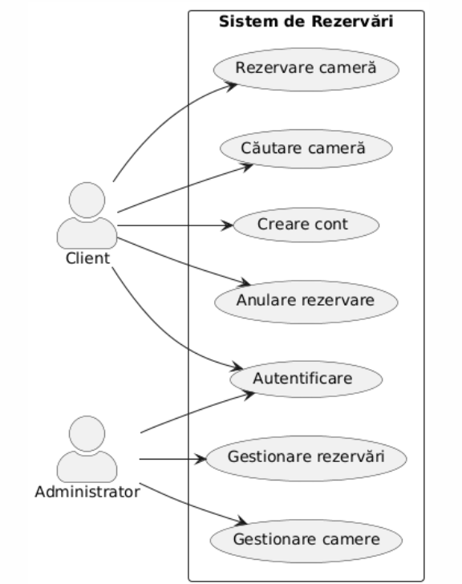
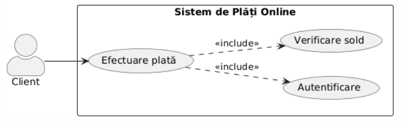
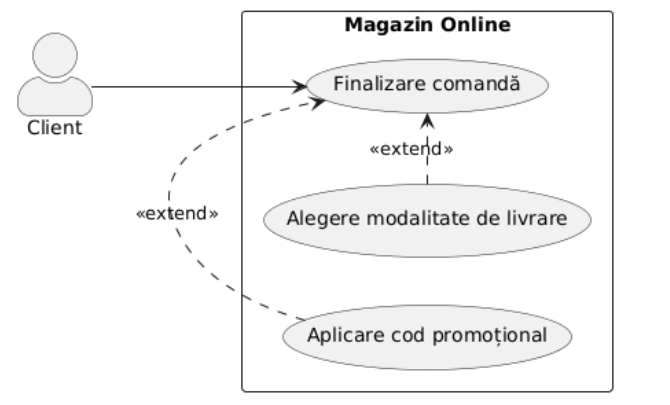
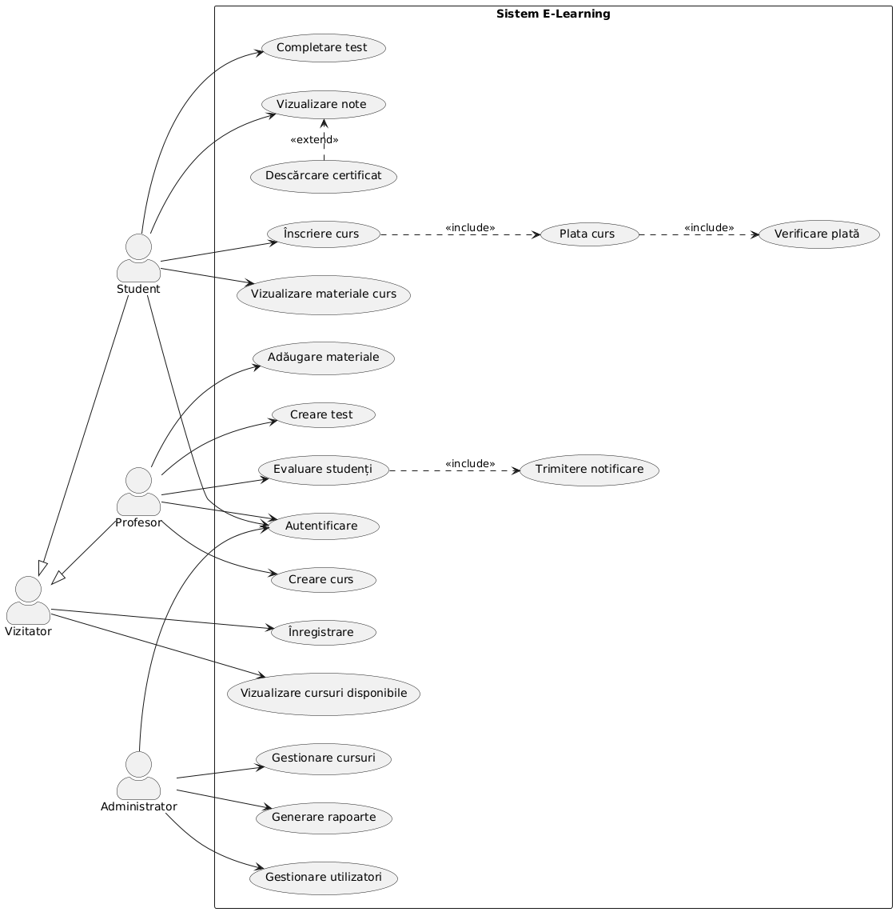
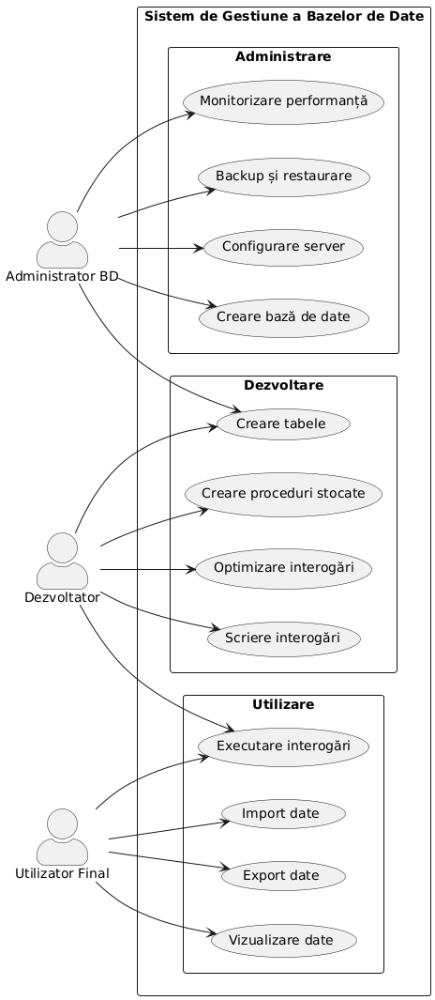
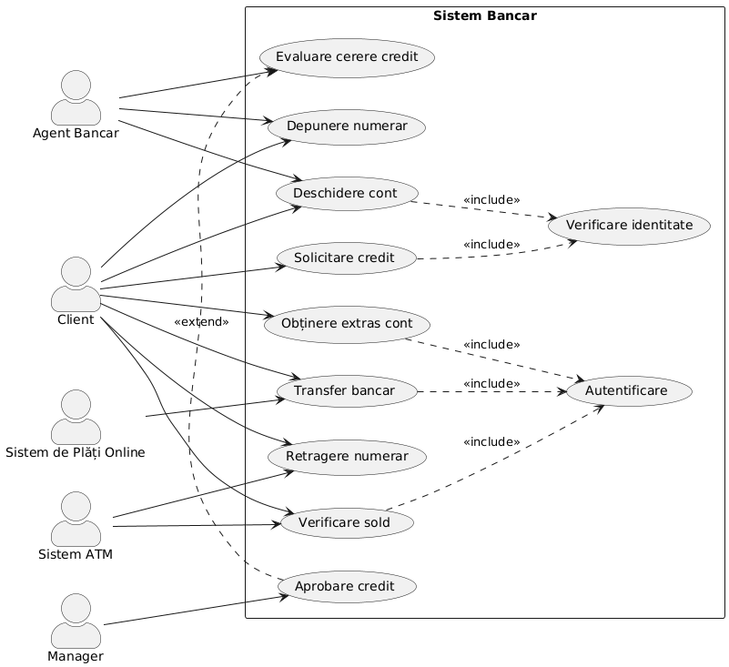

# Documentație pentru Diagrame UML Use-Case

## Introducere în diagramele Use-Case

Diagramele Use-Case reprezintă una dintre cele mai importante tehnici de modelare utilizate în Unified Modeling Language (UML) pentru captarea cerințelor funcționale ale unui sistem. Acestea oferă o reprezentare vizuală a interacțiunilor dintre utilizatori (actori) și sistem, permițând înțelegerea comportamentului sistemului din perspectiva utilizatorului.

## Elementele fundamentale ale diagramelor Use-Case

### 1. Actori

Actorii sunt entități externe care interacționează cu sistemul. Aceștia pot fi:
- Utilizatori umani (ex. client, administrator)
- Sisteme externe (ex. serviciu de plăți, API extern)
- Dispozitive hardware (ex. senzori, imprimante)

### 2. Cazuri de utilizare (Use-Cases)

Cazurile de utilizare reprezintă funcționalitățile sau serviciile oferite de sistem actorilor. Acestea descriu ce face sistemul, nu cum face.

### 3. Relații

Există mai multe tipuri de relații în diagramele Use-Case:
- **Asociere**: Conexiunea dintre un actor și un caz de utilizare
- **Include**: Un caz de utilizare include funcționalitatea altui caz de utilizare
- **Extend**: Un caz de utilizare extinde comportamentul altui caz de utilizare
- **Generalizare**: Relație de tip părinte-copil între cazuri de utilizare sau între actori

## Exemplificarea diagramelor Use-Case cu PlantUML

PlantUML este un instrument care permite crearea diagramelor UML folosind un limbaj de scripting simplu. Mai jos sunt prezentate exemple pentru fiecare element și relație.

### Exemplu 1: Diagramă Use-Case de bază



Diagrama de mai sus ilustrează un sistem de rezervări hoteliere cu doi actori principali: Clientul și Administratorul. Fiecare actor interacționează cu sistemul prin intermediul unor cazuri de utilizare specifice.

### Exemplu 2: Relația Include



Relația Include este utilizată atunci când un caz de utilizare încorporează funcționalitatea altui caz de utilizare. Se notează cu `<<include>>`.

În acest exemplu, cazul de utilizare "Efectuare plată" include obligatoriu funcționalitățile "Autentificare" și "Verificare sold". Aceasta înseamnă că, de fiecare dată când un client efectuează o plată, sistemul trebuie să îl autentifice și să verifice soldul disponibil.

### Exemplu 3: Relația Extend

Relația Extend este utilizată când un caz de utilizare poate extinde funcționalitatea altui caz de utilizare în anumite condiții. Se notează cu `<<extend>>`.



În acest exemplu, "Aplicare cod promoțional" și "Alegere modalitate de livrare" sunt cazuri de utilizare opționale care pot extinde funcționalitatea cazului de utilizare principal "Finalizare comandă".

### Exemplu 4: Relația de Generalizare

Generalizarea poate fi aplicată atât actorilor, cât și cazurilor de utilizare, reprezentând o relație de tip părinte-copil.


În acest exemplu, "Administrator" este o specializare a "Utilizator", iar "Super Administrator" este o specializare a "Administrator". Fiecare actor moștenește drepturile actorului părinte și primește drepturi suplimentare.

### Exemplu 5: Diagramă Use-Case complexă

Acum să combinăm toate conceptele într-o diagramă Use-Case complexă pentru un sistem de e-learning:



Această diagramă complexă prezintă un sistem de e-learning cu patru actori principali și numeroase cazuri de utilizare. Putem observa relații de generalizare între actori (un Student sau un Profesor sunt specializări ale unui Vizitator), relații Include (plata unui curs include verificarea plății) și relații Extend (descărcarea certificatului extinde funcționalitatea de vizualizare a notelor).

## Bune practici pentru crearea diagramelor Use-Case

1. **Păstrați simplicitatea**: Fiecare caz de utilizare trebuie să reprezinte o funcționalitate distinctă și clară.

2. **Denumiți corespunzător**: Utilizați verbe active pentru a denumi cazurile de utilizare (ex. "Creare cont", nu "Contul este creat").

3. **Evitați prea multe detalii**: Diagramele Use-Case sunt destinate să ofere o imagine de ansamblu a funcționalităților, nu detalii de implementare.

4. **Limitați numărul de actori și cazuri de utilizare**: O diagramă cu prea multe elemente devine greu de înțeles.

5. **Utilizați relațiile cu moderație**: Abuzul de relații Include și Extend poate complica inutil diagrama.

6. **Organizați în pachete**: Pentru sisteme complexe, grupați cazurile de utilizare în pachete logice.

# Specificația Detaliată a Use Case-urilor

## Template pentru Documentarea unui Use Case

Pentru fiecare Use Case identificat în diagramă, este recomandat să se creeze o specificație detaliată care descrie comportamentul Use Case-ului. Mai jos este prezentat un template pentru specificația unui Use Case:

```
# Specificație Use Case: [Numele Use Case-ului]

## 1. Descriere
[O scurtă descriere a scopului acestui Use Case]

## 2. Actori
* Actor principal: [Actorul care inițiază Use Case-ul]
* Actori secundari: [Alți actori implicați]

## 3. Precondițiii
* [Condițiile care trebuie îndeplinite înainte de executarea Use Case-ului]

## 4. Postcondiții
* [Starea sistemului după executarea cu succes a Use Case-ului]

## 5. Flux de evenimente

### 5.1 Flux de bază
1. [Primul pas]
2. [Al doilea pas]
3. ...
4. [Ultimul pas]

### 5.2 Fluxuri alternative
#### 5.2.1 [Numele fluxului alternativ 1]
* Condiție: [Condiția care determină acest flux alternativ]
* Pași:
  1. [Primul pas]
  2. [Al doilea pas]
  3. ...

#### 5.2.2 [Numele fluxului alternativ 2]
* Condiție: [Condiția care determină acest flux alternativ]
* Pași:
  1. [Primul pas]
  2. [Al doilea pas]
  3. ...

## 6. Cerințe speciale
* [Cerințe non-funcționale relevante pentru acest Use Case]

## 7. Frecvență de utilizare
* [Cât de des este utilizat acest Use Case]

## 8. Note și probleme
* [Orice informații suplimentare sau probleme identificate]
```

## Exemplu de Specificație Use Case

Mai jos este un exemplu de specificație detaliată pentru Use Case-ul "Plasare comandă" din sistemul E-commerce:

```
# Specificație Use Case: Plasare comandă

## 1. Descriere
Acest Use Case permite unui client autentificat să plaseze o comandă pentru produsele din coșul său de cumpărături.

## 2. Actori
* Actor principal: Client
* Actori secundari: Sistem de plăți

## 3. Precondițiii
* Clientul este autentificat în sistem
* Coșul de cumpărături conține cel puțin un produs
* Produsele din coș sunt disponibile în stoc

## 4. Postcondiții
* Comanda este înregistrată în sistem
* Stocul produselor este actualizat
* Clientul primește o confirmare a comenzii
* Plata este procesată (dacă metoda de plată este online)

## 5. Flux de evenimente

### 5.1 Flux de bază
1. Clientul accesează pagina coșului de cumpărături
2. Sistemul afișează produsele din coș și sumarul comenzii
3. Clientul selectează opțiunea "Finalizare comandă"
4. Sistemul solicită adresa de livrare
5. Clientul introduce sau selectează o adresă de livrare
6. Sistemul solicită metoda de plată
7. Clientul selectează metoda de plată
8. Sistemul solicită confirmarea comenzii
9. Clientul confirmă comanda
10. Sistemul procesează plata (dacă metoda este online)
11. Sistemul înregistrează comanda și actualizează stocul
12. Sistemul afișează o confirmare a comenzii și trimite un email clientului

### 5.2 Fluxuri alternative
#### 5.2.1 Produs indisponibil
* Condiție: Unul sau mai multe produse din coș nu mai sunt disponibile în stoc
* Pași:
  1. După pasul 3, sistemul verifică disponibilitatea produselor
  2. Sistemul informează clientul despre produsele indisponibile
  3. Clientul poate elimina produsele indisponibile sau anula comanda
  4. Dacă clientul elimină produsele, fluxul continuă cu pasul 4

#### 5.2.2 Eroare la procesarea plății
* Condiție: Apare o eroare la procesarea plății online
* Pași:
  1. După pasul 10, sistemul primește un răspuns negativ de la procesatorul de plăți
  2. Sistemul informează clientul despre eroare
  3. Clientul poate încerca din nou sau selecta o metodă alternativă de plată
  4. Dacă plata este procesată cu succes, fluxul continuă cu pasul 11

#### 5.2.3 Aplicare cupon de reducere
* Condiție: Clientul dorește să aplice un cupon de reducere
* Pași:
  1. Între pașii 2 și 3, clientul introduce un cod de cupon
  2. Sistemul validează cuponul și aplică reducerea
  3. Fluxul continuă cu pasul 3 cu sumarul comenzii actualizat

## 6. Cerințe speciale
* Timpul de procesare a comenzii nu trebuie să depășească 5 secunde
* Toate datele transmise în timpul procesării plății trebuie să fie criptate

## 7. Frecvență de utilizare
* Foarte frecvent (mai mult de 100 de ori pe zi)

## 8. Note și probleme
* Este necesară implementarea unui mecanism de rezervare temporară a stocului în timpul procesării comenzii
* Trebuie investigată integrarea cu mai mulți procesatori de plăți pentru redundanță
```

## Relația dintre Diagramele Use Case și Specificații

Diagramele Use Case oferă o vizualizare de ansamblu asupra sistemului, dar nu conțin toate detaliile necesare pentru implementare. Specificațiile Use Case completează diagramele prin:

1. **Detalii de implementare** - Descriu pașii concreți pentru fiecare funcționalitate
2. **Tratarea excepțiilor** - Specifică modul de gestionare a scenariilor alternative
3. **Precondițiii și postcondiții** - Definesc starea sistemului înainte și după executarea Use Case-ului
4. **Cerințe non-funcționale** - Adaugă informații despre performanță, securitate, etc.

Împreună, diagramele și specificațiile Use Case formează o documentație completă a cerințelor funcționale ale sistemului, care poate fi utilizată de echipele de dezvoltare pentru implementare.
## Alte exemple

### Exemplu pentru un sistem de baze de date:



### Exemplu pentru un sistem bancar:



## Concluzii

Diagramele Use-Case sunt instrumente puternice pentru modelarea cerințelor funcționale ale unui sistem. Acestea facilitează comunicarea între dezvoltatori și stakeholderi, oferind o imagine clară a funcționalităților sistemului din perspectiva utilizatorului.

Prin utilizarea PlantUML, puteți crea și actualiza ușor diagrame Use-Case profesionale pentru proiectele dumneavoastră. Sintaxa simplă și expresivă a PlantUML vă permite să vă concentrați pe modelarea sistemului, nu pe aspectele tehnice ale desenării diagramelor.

Învățarea și utilizarea diagramelor Use-Case reprezintă un pas important în analiza și proiectarea sistemelor informatice, asigurând că funcționalitățile dezvoltate satisfac nevoile reale ale utilizatorilor.


