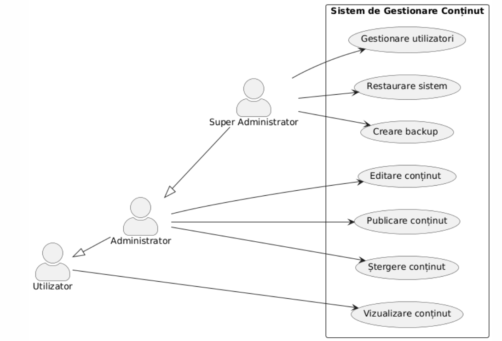

# Documentație pentru Diagrame UML Use-Case

## Introducere în diagramele Use-Case

Diagramele Use-Case reprezintă una dintre cele mai importante tehnici de modelare utilizate în Unified Modeling Language (UML) pentru captarea cerințelor funcționale ale unui sistem. Acestea oferă o reprezentare vizuală a interacțiunilor dintre utilizatori (actori) și sistem, permițând înțelegerea comportamentului sistemului din perspectiva utilizatorului.

## Elementele fundamentale ale diagramelor Use-Case

### 1. Actori

Actorii sunt entități externe care interacționează cu sistemul. Aceștia pot fi:
- Utilizatori umani (ex. client, administrator)
- Sisteme externe (ex. serviciu de plăți, API extern)
- Dispozitive hardware (ex. senzori, imprimante)

### 2. Cazuri de utilizare (Use-Cases)

Cazurile de utilizare reprezintă funcționalitățile sau serviciile oferite de sistem actorilor. Acestea descriu ce face sistemul, nu cum face.

### 3. Relații

Există mai multe tipuri de relații în diagramele Use-Case:
- **Asociere**: Conexiunea dintre un actor și un caz de utilizare
- **Include**: Un caz de utilizare include funcționalitatea altui caz de utilizare
- **Extend**: Un caz de utilizare extinde comportamentul altui caz de utilizare
- **Generalizare**: Relație de tip părinte-copil între cazuri de utilizare sau între actori

## Exemplificarea diagramelor Use-Case cu PlantUML

PlantUML este un instrument care permite crearea diagramelor UML folosind un limbaj de scripting simplu. Mai jos sunt prezentate exemple pentru fiecare element și relație.

### Exemplu 1: Diagramă Use-Case de bază

Diagrama de mai sus ilustrează un sistem de rezervări hoteliere cu doi actori principali: Clientul și Administratorul. Fiecare actor interacționează cu sistemul prin intermediul unor cazuri de utilizare specifice.

### Exemplu 2: Relația Include

Relația Include este utilizată atunci când un caz de utilizare încorporează funcționalitatea altui caz de utilizare. Se notează cu `<<include>>`.

În acest exemplu, cazul de utilizare "Efectuare plată" include obligatoriu funcționalitățile "Autentificare" și "Verificare sold". Aceasta înseamnă că, de fiecare dată când un client efectuează o plată, sistemul trebuie să îl autentifice și să verifice soldul disponibil.

### Exemplu 3: Relația Extend

Relația Extend este utilizată când un caz de utilizare poate extinde funcționalitatea altui caz de utilizare în anumite condiții. Se notează cu `<<extend>>`.

În acest exemplu, "Aplicare cod promoțional" și "Alegere modalitate de livrare" sunt cazuri de utilizare opționale care pot extinde funcționalitatea cazului de utilizare principal "Finalizare comandă".

### Exemplu 4: Relația de Generalizare

Generalizarea poate fi aplicată atât actorilor, cât și cazurilor de utilizare, reprezentând o relație de tip părinte-copil.

În acest exemplu, "Administrator" este o specializare a "Utilizator", iar "Super Administrator" este o specializare a "Administrator". Fiecare actor moștenește drepturile actorului părinte și primește drepturi suplimentare.

### Exemplu 5: Diagramă Use-Case complexă

Acum să combinăm toate conceptele într-o diagramă Use-Case complexă pentru un sistem de e-learning:

Această diagramă complexă prezintă un sistem de e-learning cu patru actori principali și numeroase cazuri de utilizare. Putem observa relații de generalizare între actori (un Student sau un Profesor sunt specializări ale unui Vizitator), relații Include (plata unui curs include verificarea plății) și relații Extend (descărcarea certificatului extinde funcționalitatea de vizualizare a notelor).

## Bune practici pentru crearea diagramelor Use-Case

1. **Păstrați simplicitatea**: Fiecare caz de utilizare trebuie să reprezinte o funcționalitate distinctă și clară.

2. **Denumiți corespunzător**: Utilizați verbe active pentru a denumi cazurile de utilizare (ex. "Creare cont", nu "Contul este creat").

3. **Evitați prea multe detalii**: Diagramele Use-Case sunt destinate să ofere o imagine de ansamblu a funcționalităților, nu detalii de implementare.

4. **Limitați numărul de actori și cazuri de utilizare**: O diagramă cu prea multe elemente devine greu de înțeles.

5. **Utilizați relațiile cu moderație**: Abuzul de relații Include și Extend poate complica inutil diagrama.

6. **Organizați în pachete**: Pentru sisteme complexe, grupați cazurile de utilizare în pachete logice.

