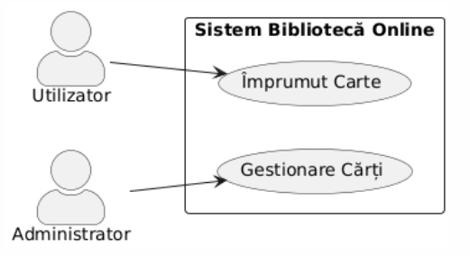

# Documentația suplimentară pentru diagramele Use-Case

## Introducere

Diagramele Use-Case oferă o reprezentare vizuală a funcționalităților unui sistem, însă pentru a fi cu adevărat eficiente, acestea trebuie însoțite de documentație suplimentară detaliată. Această documentație completează diagrama vizuală, oferind informații esențiale care nu pot fi exprimate grafic.

## Tipuri de documentație suplimentară pentru diagramele Use-Case

### 1. Descrierea actorilor

Pentru fiecare actor identificat în diagramă, documentația ar trebui să includă:

- **Numele actorului**: Denumirea exactă folosită în diagramă
- **Descriere**: Rolul și responsabilitățile actorului
- **Caracteristici**: Informații relevante despre actor (nivel de acces, frecvență de utilizare etc.)
- **Relații cu alți actori**: Ierarhii sau interacțiuni specifice

### 2. Specificații pentru fiecare Use-Case

Fiecare Use-Case din diagramă necesită o descriere detaliată sub forma unei specificații care include:

#### a) Informații de bază:
- **Identificator**: Cod unic de identificare (ex. UC-01)
- **Nume**: Denumirea Use-Case-ului
- **Descriere**: Scurtă explicație a scopului
- **Actori primari și secundari**: Actorii implicați
- **Pre-condiții**: Condițiile care trebuie îndeplinite înainte de executarea Use-Case-ului
- **Post-condiții**: Starea sistemului după executarea cu succes a Use-Case-ului
- **Prioritate**: Importanța relativă (înaltă, medie, scăzută)

#### b) Flux de evenimente:
- **Flux de bază (Main Flow)**: Secvența normală de pași pentru executarea cu succes
- **Fluxuri alternative**: Scenarii alternative care pot apărea
- **Fluxuri de excepție**: Scenarii de eroare și modul de gestionare

#### c) Informații suplimentare:
- **Cerințe non-funcționale**: Performanță, securitate, disponibilitate etc.
- **Puncte de extindere**: Unde poate fi extins Use-Case-ul
- **Frecvența de utilizare**: Cât de des este utilizat
- **Interfețe asociate**: Schițe UI/UX sau referințe la acestea

### 3. Glosar de termeni

Un glosar care explică termenii specifici domeniului utilizați în specificațiile Use-Case.

### 4. Matricea de trasabilitate

O matrice care conectează Use-Case-urile cu cerințele de business și cu alte artefacte de dezvoltare (componente, teste etc.).

## Exemplu de documentație suplimentară

Mai jos este prezentat un exemplu simplu de documentație pentru un sistem de bibliotecă online cu două Use-Case-uri.

### Descrierea actorilor

#### Actor: Utilizator
- **Descriere**: Persoană care utilizează biblioteca online pentru a împrumuta cărți.
- **Caracteristici**: Necesită cont în sistem, poate avea împrumuturi active, poate avea istoric de împrumuturi.
- **Relații**: Nu are relații ierarhice cu alți actori.

#### Actor: Administrator
- **Descriere**: Persoană responsabilă cu gestionarea catalogului de cărți din biblioteca online.
- **Caracteristici**: Are drepturi de administrare completă asupra sistemului, poate adăuga/modifica/șterge cărți din sistem.
- **Relații**: Nu are relații ierarhice cu alți actori.

### Specificațiile Use-Case-urilor

#### UC-01: Împrumut Carte

**Informații de bază:**
- **Identificator**: UC-01
- **Nume**: Împrumut Carte
- **Descriere**: Permite utilizatorului să împrumute o carte din biblioteca online
- **Actori primari**: Utilizator
- **Actori secundari**: Nu există
- **Pre-condiții**:
    - Utilizatorul este autentificat în sistem
    - Cartea este disponibilă pentru împrumut
    - Utilizatorul nu a depășit numărul maxim de împrumuturi permise
- **Post-condiții**:
    - Cartea este marcată ca împrumutată
    - Termenul de returnare este stabilit
    - Istoricul utilizatorului este actualizat
- **Prioritate**: Înaltă

**Flux de evenimente:**
- **Flux de bază**:
    1. Utilizatorul accesează catalogul de cărți
    2. Utilizatorul caută cartea dorită
    3. Utilizatorul selectează cartea
    4. Utilizatorul alege opțiunea "Împrumută"
    5. Sistemul verifică disponibilitatea cărții
    6. Sistemul verifică eligibilitatea utilizatorului
    7. Sistemul confirmă împrumutul
    8. Sistemul afișează data limită de returnare

- **Fluxuri alternative**:
    - 2a. Utilizatorul nu găsește cartea:
        1. Utilizatorul poate solicita ajutor pentru căutare
        2. Se revine la pasul 2

- **Fluxuri de excepție**:
    - 5a. Cartea nu este disponibilă:
        1. Sistemul informează utilizatorul că cartea nu este disponibilă
        2. Sistemul oferă opțiunea de rezervare
        3. Procesul se încheie sau continuă cu rezervarea
    - 6a. Utilizatorul a depășit limita de împrumuturi:
        1. Sistemul informează utilizatorul despre limitare
        2. Procesul se încheie

**Informații suplimentare:**
- **Cerințe non-funcționale**: Timpul de răspuns pentru confirmarea împrumutului trebuie să fie sub 3 secunde
- **Frecvența de utilizare**: Foarte frecvent (de câteva ori pe zi)
- **Interfețe asociate**: Pagina de catalog, Pagina de detalii carte, Dialog confirmare împrumut

#### UC-02: Gestionare Cărți

**Informații de bază:**
- **Identificator**: UC-02
- **Nume**: Gestionare Cărți
- **Descriere**: Permite administratorului să adauge, modifice sau să șteargă cărți din catalog
- **Actori primari**: Administrator
- **Actori secundari**: Nu există
- **Pre-condiții**: Administratorul este autentificat cu drepturi de administrare
- **Post-condiții**: Catalogul de cărți este actualizat conform modificărilor
- **Prioritate**: Medie

**Flux de evenimente:**
- **Flux de bază**:
    1. Administratorul accesează interfața de administrare
    2. Administratorul selectează opțiunea "Gestionare cărți"
    3. Sistemul afișează lista curentă de cărți
    4. Administratorul poate:
        - Adăuga o carte nouă
        - Modifica o carte existentă
        - Șterge o carte existentă
    5. Administratorul efectuează modificările dorite
    6. Sistemul validează datele introduse
    7. Sistemul salvează modificările
    8. Sistemul confirmă actualizarea catalogului

- **Fluxuri alternative**:
    - 4a. Adăugare carte nouă:
        1. Administratorul completează formularul cu detaliile cărții
        2. Administratorul încarcă imaginea copertei (opțional)
        3. Se continuă cu pasul 6

    - 4b. Modificare carte existentă:
        1. Administratorul selectează cartea din listă
        2. Administratorul modifică detaliile necesare
        3. Se continuă cu pasul 6

    - 4c. Ștergere carte existentă:
        1. Administratorul selectează cartea din listă
        2. Administratorul confirmă intenția de ștergere
        3. Se continuă cu pasul 7

- **Fluxuri de excepție**:
    - 6a. Datele introduse sunt invalide:
        1. Sistemul evidențiază câmpurile cu probleme
        2. Sistemul afișează mesaje de eroare specifice
        3. Se revine la pasul 5

**Informații suplimentare:**
- **Cerințe non-funcționale**: Interfața trebuie să permită adăugarea/modificarea în masă a mai multor cărți
- **Frecvența de utilizare**: Ocazional (de câteva ori pe săptămână)
- **Interfețe asociate**: Pagina de administrare, Formular adăugare/editare carte

### Glosar de termeni

| Termen | Definiție |
|--------|-----------|
| Împrumut | Acțiunea prin care un utilizator obține dreptul temporar de a accesa o carte pentru o perioadă specificată |
| Catalog | Colecția completă de cărți disponibile în bibliotecă |
| Disponibilitate | Starea unei cărți care poate fi împrumutată |
| Termen de returnare | Data limită până la care o carte trebuie returnată |

### Matricea de trasabilitate

| ID Cerință | ID Use-Case | Componente afectate | Teste asociate |
|------------|-------------|---------------------|----------------|
| REQ-001 | UC-01 | Modul Catalog, Modul Împrumuturi | TC-001, TC-002 |
| REQ-002 | UC-02 | Modul Administrare, Modul Catalog | TC-003, TC-004 |

## Importanța documentației suplimentare

Documentația suplimentară pentru diagramele Use-Case are mai multe beneficii importante:

1. **Claritate și precizie**: Oferă detalii care nu pot fi reprezentate grafic în diagramă
2. **Comunicare eficientă**: Asigură înțelegerea comună între toți stakeholderii
3. **Bază pentru testare**: Fluxurile descrise sunt utilizate pentru dezvoltarea cazurilor de test
4. **Trasabilitate**: Permite urmărirea implementării cerințelor în toate fazele proiectului
5. **Referință pentru dezvoltare**: Ghidează dezvoltatorii în implementarea funcționalităților

## Concluzii

Diagramele Use-Case reprezintă doar o parte din documentația necesară pentru descrierea cerințelor funcționale ale unui sistem. Documentația suplimentară prezentată aici completează diagramele vizuale, oferind informațiile detaliate esențiale pentru analiză, dezvoltare, testare și implementare.

Pentru a maximiza eficiența, este recomandat să se utilizeze șabloane standardizate pentru documentația suplimentară și să se mențină sincronizarea între diagrame și documentația asociată pe parcursul întregului ciclu de dezvoltare.