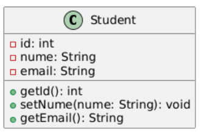
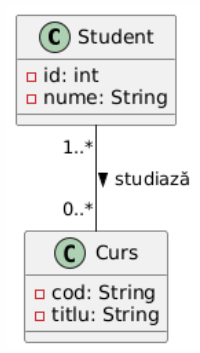
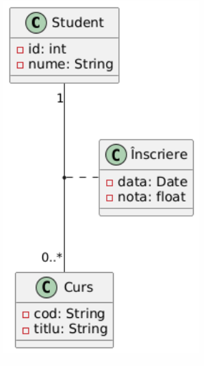
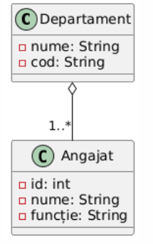
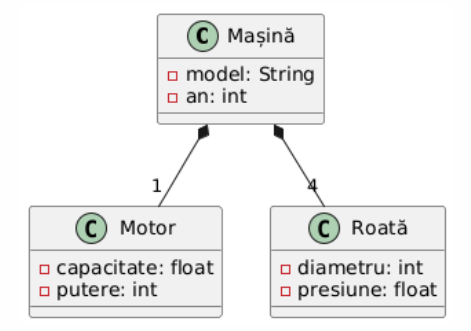
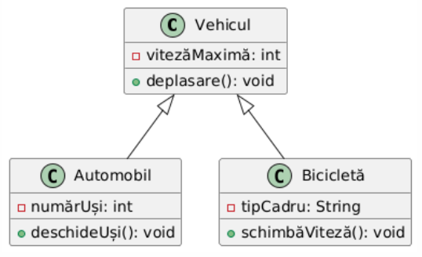
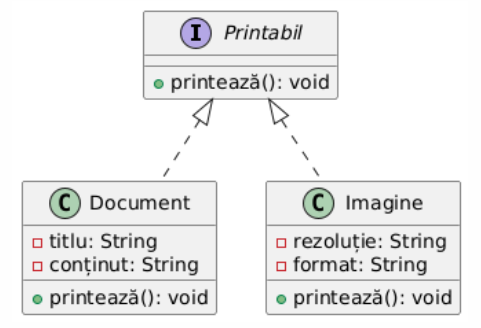
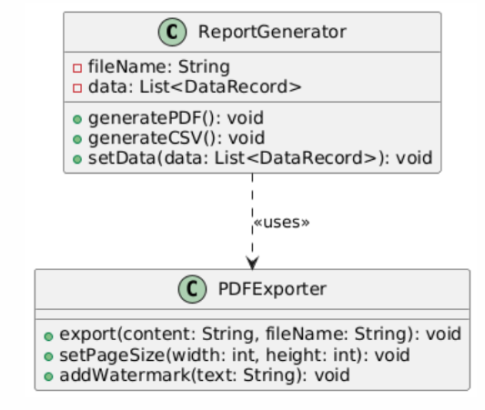
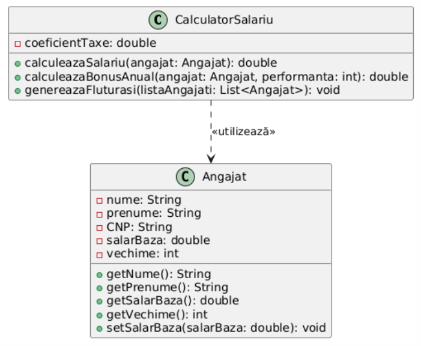

# Diagrame de Clase UML

## Introducere

Diagramele de clase reprezintă un element fundamental în limbajul de modelare UML (Unified Modeling Language), fiind utilizate pentru descrierea structurală a unui sistem software. Aceste diagrame evidențiază clasele din sistem, atributele și metodele acestora, precum și relațiile dintre clase, oferind o reprezentare vizuală clară a arhitecturii sistemului.

## Elementele fundamentale ale unei diagrame de clase

### 1. Clasa

Clasa este reprezentată grafic printr-un dreptunghi împărțit în trei secțiuni:
- **Numele clasei** - plasat în secțiunea superioară (începe cu literă mare)
- **Atributele** - listate în secțiunea din mijloc
- **Metodele** - listate în secțiunea inferioară

### 2. Interfața

Interfața este un tip special de clasă care conține doar declarații de metode, fără implementări. În UML, interfețele pot fi reprezentate în două moduri:
- Ca un dreptunghi similar unei clase, marcat cu stereotipul «interface»
- Ca un cerc mic (notație simplificată) cu numele interfeței scris lângă acesta

### 3. Specificatori de acces

Specificatorii de acces definesc vizibilitatea atributelor și metodelor:
- **Public (+)**: Accesibil din orice parte a sistemului
- **Private (-)**: Accesibil doar din interiorul clasei
- **Protected (#)**: Accesibil din clasa curentă și clasele derivate
- **Acces de pachet (~)**: Accesibil doar din același pachet

## Relații între clase

### 1. Asociere

Asocierea reprezintă o relație generală între clase, indicând că obiectele acestor clase interacționează între ele. Poate fi:
- **Bidirecțională**: Reprezentată printr-o linie simplă
- **Unidirecțională**: Reprezentată printr-o linie cu săgeată la unul din capete

#### Multiplicitate

Multiplicitatea definește câte obiecte de un anumit tip pot fi asociate cu un obiect de alt tip:
- **1**: Exact un obiect
- **0..1**: Zero sau un obiect
- **1..***: Unul sau mai multe obiecte
- **0..***: Zero sau mai multe obiecte (notație alternativă: *)
- **n**: Exact n obiecte
- **a..b**: Minim a și maxim b obiecte

#### Clasă de asociere

Atunci când o asociere necesită stocarea unor informații suplimentare, poate fi folosită o clasă de asociere.

### 2. Agregare simplă

Agregarea este un tip special de asociere care reprezintă o relație de tip "întreg-parte", unde părțile pot exista independent de întreg:
- Reprezentată printr-o linie cu un romb gol la capătul "întregului"
- Părțile pot exista și în absența întregului
- Un obiect poate fi parte a mai multor obiecte "întreg"

### 3. Compoziție

Compoziția este o formă mai puternică de agregare, indicând o relație de tip "întreg-parte" în care:
- Este reprezentată printr-o linie cu un romb plin la capătul "întregului"
- Ciclul de viață al părților este legat de cel al întregului
- Părțile nu pot exista fără întreg
- Părțile aparțin exclusiv unui singur întreg

### 4. Moștenire (Extindere)

Moștenirea reprezintă o relație "este-un" între clase, permițând unei clase derivate să moștenească atributele și metodele unei clase de bază:
- Reprezentată printr-o linie cu o săgeată goală orientată spre clasa de bază
- Clasa derivată poate adăuga noi atribute și metode
- Clasa derivată poate suprascrie metodele clasei de bază

### 5. Implementare interfață

Implementarea interfeței arată că o clasă implementează funcționalitatea definită într-o interfață:
- Reprezentată printr-o linie punctată cu o săgeată goală orientată spre interfață
- Clasa care implementează interfața trebuie să ofere implementări pentru toate metodele declarate în interfață

### 6. Dependență

Dependența este o relație indicațională în care o modificare într-o clasă poate afecta o altă clasă. Aceasta este utilizată pentru a arăta că o clasă utilizează sau se bazează pe funcționalitatea furnizată de o altă clasă, de obicei pe termen scurt.

- Reprezentată printr-o linie punctată cu o săgeată orientată spre clasa de care depinde.
- Dependența este de obicei de scurtă durată și nu implică o relație de proprietate sau de moștenire.

Exemplu: Relația de dependență poate fi folosită atunci când într-o clasă există o metodă care primește un argument de tipul altei clase, returnează un obiect de tipul altei clase sau utilizeaza in interiorul unei moetode un obiect dintr-o alta clasa.

Utilitatea practică a relației de dependență este limitată și se utilizează adesea atunci când este necesar să se evidențieze anumite dependențe esențiale în cod. Uneori, poate fi destul de dificil de intuit modul în care o diagramă ce reprezintă o relație de dependență poate fi transpusa în cod, deoarece această relație nu implică o legătură structurală puternică între clase.

## Recomandări pentru construirea diagramelor de clase

1. **Nivel de detaliu adecvat**: Alegeți nivelul de detaliu potrivit scopului diagramei:
    - Diagrame conceptuale: doar numele claselor și relațiile dintre ele
    - Diagrame de proiectare: include atribute și metode esențiale
    - Diagrame de implementare: toate atributele și metodele relevante

2. **Claritate vizuală**:
    - Evitați supraîncărcarea diagramei cu prea multe clase
    - Grupați clasele înrudite în același pachet sau zonă a diagramei
    - Folosiți notații consistente pentru multiplicitate și roluri

3. **Relationări corecte**:
    - Alegeți tipul potrivit de relație (asociere, agregare, compoziție, moștenire)
    - Indicați multiplicitățile la capătul corect al asocierilor
    - Adăugați nume la asocieri pentru a clarifica contextul relației

4. **Convenții de denumire**:
    - Numele claselor încep cu literă mare
    - Numele atributelor și metodelor încep cu literă mică
    - Folosiți convenții de denumire consistente (camelCase sau underscore_case)

## Concluzii

Diagramele de clase sunt instrumente esențiale în proiectarea orientată pe obiecte, oferind o reprezentare vizuală clară a structurii sistemului. Aceste diagrame facilitează comunicarea între membrii echipei, documentează arhitectura software și servesc ca bază pentru implementarea sistemului.

Utilizarea corectă a notațiilor și relațiilor UML asigură că diagramele de clase sunt ușor de înțeles și interpretate consecvent de toți participanții la proiect, contribuind semnificativ la succesul procesului de dezvoltare software.