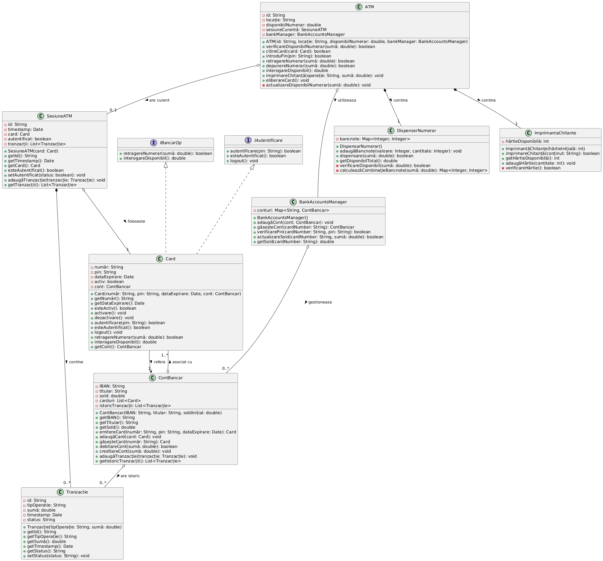

# Model ATM Bancar

## Diagrama de Clase UML

Vom crea un model complet pentru un ATM bancar, implementând operațiile de retragere de fonduri și interogare sold. Modelul va evidenția relațiile de agregare, compoziție și implementare de interfețe.



## Relația dintre Diagrama de Clase și Implementarea în Java

Implementarea în Java prezentată este orientativă și nu este în mod obligatoriu completă sau perfect corectă din punct de vedere tehnic. Scopul principal al acestui exemplu este de a ilustra modul în care o diagramă de clase UML poate fi transpusă într-o implementare concretă sau, în sens invers, cum o aplicație Java existentă poate fi reprezentată printr-o diagramă de clase.

Este important de menționat că o diagramă de clase, deși extrem de utilă, nu poate captura toate aspectele unei aplicații software. Diagrama de clase este concepută să reprezinte structura statică a sistemului - clasele, interfețele, atributele, metodele și relațiile dintre ele - însă nu oferă informații detaliate cu privire la comportamentul dinamic al aplicației.

Iată câteva limite ale diagramelor de clase:

1. **Nu captează implementarea metodelor** - Diagrama de clase indică doar semnătura metodelor (nume, parametri, tip returnat), dar nu și algoritmii sau logica de business implementată în acestea. De exemplu, în diagrama ATM-ului vedem că există o metodă `retragereNumerar()`, dar nu putem vedea verificările, validările și operațiile care se execută în interiorul acesteia.

2. **Nu reprezintă fluxul de execuție** - Ordinea în care sunt apelate metodele și condițiile în care acestea sunt executate nu sunt vizibile în diagrama de clase. Pentru acest scop sunt necesare alte tipuri de diagrame UML, cum ar fi diagramele de secvență sau diagrame de activitate.

3. **Nu reflectă starea obiectelor în timp** - Valorile atributelor și modul în care acestea se schimbă pe parcursul execuției programului nu sunt reprezentate în diagrama de clase.

4. **Nu captează excepțiile și tratarea erorilor** - Mecanismele de gestionare a excepțiilor sunt de obicei absente din diagramele de clase standard.

În practică, dezvoltatorii interpretează și adaptează diagramele de clase conform contextului specific și cerințelor proiectului. Adesea, implementarea finală poate conține clase ajutătoare suplimentare, metode private auxiliare, constante, enum-uri sau alte elemente care pot să nu fie reprezentate explicit în diagrama inițială.

De asemenea, aspecte precum sincronizarea pentru programarea multi-threading, gestionarea resurselor, optimizările de performanță sau specificul framework-urilor utilizate pot necesita modificări substanțiale față de diagrama conceptuală.

Diagramele de clase trebuie privite ca instrumente de proiectare și comunicare, nu ca specificații rigide. Ele oferă o imagine de ansamblu a structurii sistemului și facilitează înțelegerea relațiilor dintre componente, dar implementarea concretă va fi întotdeauna influențată de considerente practice, tehnice și de context.

Pentru o înțelegere completă a unui sistem software, diagrama de clase trebuie completată cu alte tipuri de diagrame UML și cu documentație adecvată care să explice aspectele comportamentale și de implementare care nu pot fi exprimate vizual în formatul standardizat al diagramelor de clase.

## Implementare Java

```java
// Interfețe
interface IBancarOp {
    boolean retragereNumerar(double suma);
    double interogareDisponibil();
}

interface IAutentificare {
    boolean autentificare(String pin);
    boolean esteAutentificat();
    void logout();
}

// Clasa ATM - conține prin compoziție DispensarNumerar și ImprimantăChitanțe
class ATM {
    private String id;
    private String locatie;
    private double disponibilNumerar;
    private SesiuneATM sesiuneCurenta;
    private BankAccountsManager bankManager;
    
    // Compoziție - ATM creează aceste obiecte în constructor
    private final DispensarNumerar dispensarNumerar;
    private final ImprimantaChitante imprimantaChitante;
    
    public ATM(String id, String locatie, double disponibilNumerar, BankAccountsManager bankManager) {
        this.id = id;
        this.locatie = locatie;
        this.disponibilNumerar = disponibilNumerar;
        this.bankManager = bankManager;
        
        // Crearea componentelor prin compoziție
        this.dispensarNumerar = new DispensarNumerar();
        this.imprimantaChitante = new ImprimantaChitante(500); // 500 de foi inițial
        
        // Inițializare dispensar cu bancnote
        dispensarNumerar.adaugaBancnote(100, 100); // 100 de bancnote de 100 RON
        dispensarNumerar.adaugaBancnote(50, 100);  // 100 de bancnote de 50 RON
        dispensarNumerar.adaugaBancnote(10, 100);  // 100 de bancnote de 10 RON
    }
    
    public boolean verificareDisponibilNumerar(double suma) {
        return dispensarNumerar.verificareDisponibil(suma);
    }
    
    public boolean citireCard(Card card) {
        if (card != null && card.esteActiv()) {
            this.sesiuneCurenta = new SesiuneATM(card);
            return true;
        }
        return false;
    }
    
    public boolean introduPin(String pin) {
        if (sesiuneCurenta != null && sesiuneCurenta.getCard() != null) {
            Card card = sesiuneCurenta.getCard();
            boolean autentificat = card.autentificare(pin);
            sesiuneCurenta.setAutentificat(autentificat);
            return autentificat;
        }
        return false;
    }
    
    public boolean retragereNumerar(double suma) {
        if (sesiuneCurenta == null || !sesiuneCurenta.esteAutentificat()) {
            return false;
        }
        
        Card card = sesiuneCurenta.getCard();
        
        // Verificăm dacă există suficienți bani în cont
        if (card.interogareDisponibil() < suma) {
            return false;
        }
        
        // Verificăm dacă ATM-ul poate dispensa suma
        if (!verificareDisponibilNumerar(suma)) {
            return false;
        }
        
        // Retragem bani din cont
        boolean retragereSucees = card.retragereNumerar(suma);
        
        if (retragereSucees) {
            // Eliberăm bancnotele
            dispensarNumerar.dispensare(suma);
            
            // Înregistrăm tranzacția
            Tranzactie tranzactie = new Tranzactie("RETRAGERE", suma);
            tranzactie.setStatus("SUCCES");
            sesiuneCurenta.adaugaTranzactie(tranzactie);
            
            // Imprimăm chitanța
            imprimareChitanta("RETRAGERE", suma);
            
            // Actualizăm disponibilul din ATM
            actualizareDisponibilNumerar(-suma);
            
            return true;
        }
        
        return false;
    }
    
    public double interogareDisponibil() {
        if (sesiuneCurenta == null || !sesiuneCurenta.esteAutentificat()) {
            return -1;
        }
        
        Card card = sesiuneCurenta.getCard();
        double sold = card.interogareDisponibil();
        
        // Înregistrăm tranzacția
        Tranzactie tranzactie = new Tranzactie("INTEROGARE_SOLD", 0);
        tranzactie.setStatus("SUCCES");
        sesiuneCurenta.adaugaTranzactie(tranzactie);
        
        // Imprimăm chitanța
        imprimareChitanta("INTEROGARE_SOLD", sold);
        
        return sold;
    }
    
    public void imprimareChitanta(String operatie, double suma) {
        StringBuilder continut = new StringBuilder();
        continut.append("ATM: ").append(id).append(" - ").append(locatie).append("\n");
        continut.append("Data: ").append(new java.util.Date()).append("\n");
        continut.append("Operatie: ").append(operatie).append("\n");
        continut.append("Suma: ").append(suma).append(" RON\n");
        
        if (operatie.equals("INTEROGARE_SOLD")) {
            continut.append("Sold disponibil: ").append(suma).append(" RON\n");
        }
        
        if (operatie.equals("RETRAGERE")) {
            continut.append("Sold disponibil: ").append(sesiuneCurenta.getCard().interogareDisponibil()).append(" RON\n");
        }
        
        imprimantaChitante.imprimareChitanta(continut.toString());
    }
    
    public void eliberareCard() {
        if (sesiuneCurenta != null) {
            Card card = sesiuneCurenta.getCard();
            if (card != null) {
                card.logout();
            }
            sesiuneCurenta = null;
        }
    }
    
    private void actualizareDisponibilNumerar(double suma) {
        this.disponibilNumerar += suma;
    }
}

class SesiuneATM {
    private String id;
    private java.util.Date timestamp;
    private Card card;
    private boolean autentificat;
    private java.util.List<Tranzactie> tranzactii;
    
    public SesiuneATM(Card card) {
        this.id = java.util.UUID.randomUUID().toString();
        this.timestamp = new java.util.Date();
        this.card = card;
        this.autentificat = false;
        this.tranzactii = new java.util.ArrayList<>();
    }
    
    public String getId() {
        return id;
    }
    
    public java.util.Date getTimestamp() {
        return timestamp;
    }
    
    public Card getCard() {
        return card;
    }
    
    public boolean esteAutentificat() {
        return autentificat;
    }
    
    public void setAutentificat(boolean status) {
        this.autentificat = status;
    }
    
    public void adaugaTranzactie(Tranzactie tranzactie) {
        this.tranzactii.add(tranzactie);
    }
    
    public java.util.List<Tranzactie> getTranzactii() {
        return new java.util.ArrayList<>(tranzactii);
    }
}

class Tranzactie {
    private String id;
    private String tipOperatie;
    private double suma;
    private java.util.Date timestamp;
    private String status;
    
    public Tranzactie(String tipOperatie, double suma) {
        this.id = java.util.UUID.randomUUID().toString();
        this.tipOperatie = tipOperatie;
        this.suma = suma;
        this.timestamp = new java.util.Date();
        this.status = "PENDING";
    }
    
    public String getId() {
        return id;
    }
    
    public String getTipOperatie() {
        return tipOperatie;
    }
    
    public double getSuma() {
        return suma;
    }
    
    public java.util.Date getTimestamp() {
        return timestamp;
    }
    
    public String getStatus() {
        return status;
    }
    
    public void setStatus(String status) {
        this.status = status;
    }
}

// BankAccountsManager - Agregare cu ContBancar
class BankAccountsManager {
    // Agregare - BankAccountsManager nu creează conturile, ci le primește din exterior
    private java.util.Map<String, ContBancar> conturi;
    
    public BankAccountsManager() {
        this.conturi = new java.util.HashMap<>();
    }
    
    public void adaugaCont(ContBancar cont) {
        if (cont != null) {
            // Mapăm toate cardurile contului către acest cont pentru căutare rapidă
            for (Card card : cont.getCarduri()) {
                conturi.put(card.getNumar(), cont);
            }
        }
    }
    
    public ContBancar gasesteCont(String cardNumber) {
        return conturi.get(cardNumber);
    }
    
    public boolean verificarePin(String cardNumber, String pin) {
        ContBancar cont = gasesteCont(cardNumber);
        if (cont != null) {
            Card card = cont.gasesteCard(cardNumber);
            if (card != null) {
                return card.autentificare(pin);
            }
        }
        return false;
    }
    
    public boolean actualizareSold(String cardNumber, double suma) {
        ContBancar cont = gasesteCont(cardNumber);
        if (cont != null) {
            if (suma < 0) {
                return cont.debitareCont(-suma);
            } else {
                cont.creditareCont(suma);
                return true;
            }
        }
        return false;
    }
    
    public double getSold(String cardNumber) {
        ContBancar cont = gasesteCont(cardNumber);
        if (cont != null) {
            return cont.getSold();
        }
        return -1;
    }
}

// ContBancar - Agregare cu Card
class ContBancar {
    private String IBAN;
    private String titular;
    private double sold;
    private java.util.List<Card> carduri;
    private java.util.List<Tranzactie> istoricTranzactii;
    
    public ContBancar(String IBAN, String titular, double soldInitial) {
        this.IBAN = IBAN;
        this.titular = titular;
        this.sold = soldInitial;
        this.carduri = new java.util.ArrayList<>();
        this.istoricTranzactii = new java.util.ArrayList<>();
    }
    
    public String getIBAN() {
        return IBAN;
    }
    
    public String getTitular() {
        return titular;
    }
    
    public double getSold() {
        return sold;
    }
    
    // Creează un card și stabilește relația bidirecțională
    public Card emitereCard(String numar, String pin, java.util.Date dataExpirare) {
        Card card = new Card(numar, pin, dataExpirare, this);
        carduri.add(card);
        return card;
    }
    
    public void adaugaCard(Card card) {
        if (card != null && !carduri.contains(card)) {
            carduri.add(card);
        }
    }
    
    public Card gasesteCard(String numar) {
        for (Card card : carduri) {
            if (card.getNumar().equals(numar)) {
                return card;
            }
        }
        return null;
    }
    
    public java.util.List<Card> getCarduri() {
        return new java.util.ArrayList<>(carduri);
    }
    
    public boolean debitareCont(double suma) {
        if (suma <= 0) {
            return false;
        }
        
        if (sold >= suma) {
            sold -= suma;
            Tranzactie tranzactie = new Tranzactie("DEBITARE", suma);
            tranzactie.setStatus("SUCCES");
            adaugaTranzactie(tranzactie);
            return true;
        }
        
        return false;
    }
    
    public void creditareCont(double suma) {
        if (suma > 0) {
            sold += suma;
            Tranzactie tranzactie = new Tranzactie("CREDITARE", suma);
            tranzactie.setStatus("SUCCES");
            adaugaTranzactie(tranzactie);
        }
    }
    
    public void adaugaTranzactie(Tranzactie tranzactie) {
        if (tranzactie != null) {
            istoricTranzactii.add(tranzactie);
        }
    }
    
    public java.util.List<Tranzactie> getIstoricTranzactii() {
        return new java.util.ArrayList<>(istoricTranzactii);
    }
}

// Card - Implementează interfețele IAutentificare și IBancarOp
class Card implements IAutentificare, IBancarOp {
    private String numar;
    private String pin;
    private java.util.Date dataExpirare;
    private boolean activ;
    private boolean autentificat;
    private ContBancar cont;
    
    public Card(String numar, String pin, java.util.Date dataExpirare, ContBancar cont) {
        this.numar = numar;
        this.pin = pin;
        this.dataExpirare = dataExpirare;
        this.activ = true;
        this.autentificat = false;
        this.cont = cont;
    }
    
    public String getNumar() {
        return numar;
    }
    
    public java.util.Date getDataExpirare() {
        return dataExpirare;
    }
    
    public boolean esteActiv() {
        return activ;
    }
    
    public void activare() {
        this.activ = true;
    }
    
    public void dezactivare() {
        this.activ = false;
    }
    
    @Override
    public boolean autentificare(String pin) {
        if (this.pin.equals(pin) && activ) {
            this.autentificat = true;
            return true;
        }
        return false;
    }
    
    @Override
    public boolean esteAutentificat() {
        return autentificat;
    }
    
    @Override
    public void logout() {
        this.autentificat = false;
    }
    
    @Override
    public boolean retragereNumerar(double suma) {
        if (!esteAutentificat() || !activ) {
            return false;
        }
        
        return cont.debitareCont(suma);
    }
    
    @Override
    public double interogareDisponibil() {
        if (!esteAutentificat() || !activ) {
            return -1;
        }
        
        return cont.getSold();
    }
    
    public ContBancar getCont() {
        return cont;
    }
}

// Componentă prin compoziție a ATM-ului
class DispensarNumerar {
    private java.util.Map<Integer, Integer> bancnote;
    
    public DispensarNumerar() {
        this.bancnote = new java.util.HashMap<>();
    }
    
    public void adaugaBancnote(Integer valoare, Integer cantitate) {
        if (bancnote.containsKey(valoare)) {
            bancnote.put(valoare, bancnote.get(valoare) + cantitate);
        } else {
            bancnote.put(valoare, cantitate);
        }
    }
    
    public boolean dispensare(double suma) {
        if (!verificareDisponibil(suma)) {
            return false;
        }
        
        java.util.Map<Integer, Integer> combinatieBancnote = calculeazaCombinatieBancnote(suma);
        
        if (combinatieBancnote == null) {
            return false;
        }
        
        // Actualizăm stocul de bancnote
        for (java.util.Map.Entry<Integer, Integer> entry : combinatieBancnote.entrySet()) {
            int valoare = entry.getKey();
            int cantitate = entry.getValue();
            
            bancnote.put(valoare, bancnote.get(valoare) - cantitate);
        }
        
        return true;
    }
    
    public double getDisponibilTotal() {
        double total = 0;
        for (java.util.Map.Entry<Integer, Integer> entry : bancnote.entrySet()) {
            total += entry.getKey() * entry.getValue();
        }
        return total;
    }
    
    boolean verificareDisponibil(double suma) {
        // Verificăm dacă avem suficiente bancnote pentru a acoperi suma
        return getDisponibilTotal() >= suma && calculeazaCombinatieBancnote(suma) != null;
    }
    
    private java.util.Map<Integer, Integer> calculeazaCombinatieBancnote(double suma) {
        int sumaInt = (int) suma;
        
        // Verificăm dacă suma este un multiplu de 10
        if (sumaInt % 10 != 0) {
            return null; // ATM-ul poate dispensa doar multipli de 10
        }
        
        java.util.Map<Integer, Integer> rezultat = new java.util.HashMap<>();
        
        // Sortăm bancnotele în ordine descrescătoare
        java.util.List<Integer> valori = new java.util.ArrayList<>(bancnote.keySet());
        java.util.Collections.sort(valori, java.util.Collections.reverseOrder());
        
        for (int valoare : valori) {
            int cantitateNecesara = sumaInt / valoare;
            int cantitateDisponibila = bancnote.get(valoare);
            
            int cantitateUtilizata = Math.min(cantitateNecesara, cantitateDisponibila);
            
            if (cantitateUtilizata > 0) {
                rezultat.put(valoare, cantitateUtilizata);
                sumaInt -= valoare * cantitateUtilizata;
            }
        }
        
        // Verificăm dacă am putut acoperi toată suma
        if (sumaInt == 0) {
            return rezultat;
        } else {
            return null; // Nu am putut găsi o combinație potrivită
        }
    }
}

// ImprimantaChitante - componentă prin compoziție a ATM-ului
class ImprimantaChitante {
    private int hartieDisponibila;
    
    public ImprimantaChitante(int hartieInitiala) {
        this.hartieDisponibila = hartieInitiala;
    }
    
    public boolean imprimareChitanta(String continut) {
        if (!verificareHartie()) {
            return false;
        }
        
        System.out.println("IMPRIMARE CHITANTA:");
        System.out.println("-------------------");
        System.out.println(continut);
        System.out.println("-------------------");
        
        hartieDisponibila--;
        return true;
    }
    
    public int getHartieDisponibila() {
        return hartieDisponibila;
    }
    
    public void adaugaHartie(int cantitate) {
        if (cantitate > 0) {
            hartieDisponibila += cantitate;
        }
    }
    
    private boolean verificareHartie() {
        return hartieDisponibila > 0;
    }
}

// Exemplu de utilizare
class TestATM {
    public static void main(String[] args) {
        // Creăm managerul de conturi bancare
        BankAccountsManager bankManager = new BankAccountsManager();
        
        // Creăm un cont bancar
        ContBancar cont = new ContBancar("RO49AAAA1B31007593840000", "John Doe", 1000);
        
        // Emitem un card pentru cont
        java.util.Calendar calendar = java.util.Calendar.getInstance();
        calendar.add(java.util.Calendar.YEAR, 5); // Card valabil 5 ani
        Card card = cont.emitereCard("1234567890123456", "1234", calendar.getTime());
        
        // Adăugăm contul în manager
        bankManager.adaugaCont(cont);
        
        // Creăm ATM-ul
        ATM atm = new ATM("ATM001", "Strada Principală, Nr. 1", 50000, bankManager);
        
        // Simulăm utilizarea ATM-ului
        
        // 1. Citim cardul
        boolean cardCitit = atm.citireCard(card);
        System.out.println("Card citit cu succes: " + cardCitit);
        
        // 2. Introducem PIN-ul
        boolean pinCorect = atm.introduPin("1234");
        System.out.println("PIN corect: " + pinCorect);
        
        // 3. Interogăm soldul
        double sold = atm.interogareDisponibil();
        System.out.println("Sold disponibil: " + sold + " RON");
        
        // 4. Retragem numerar
        boolean retragereReusita = atm.retragereNumerar(500);
        System.out.println("Retragere reușită: " + retragereReusita);
        
        // 5. Verificăm soldul după retragere
        sold = atm.interogareDisponibil();
        System.out.println("Sold după retragere: " + sold + " RON");
        
        // 6. Eliberăm cardul
        atm.eliberareCard();
        System.out.println("Card eliberat");
    }
}
```