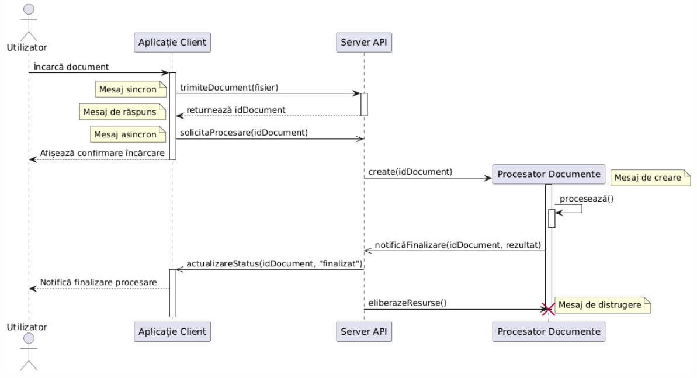
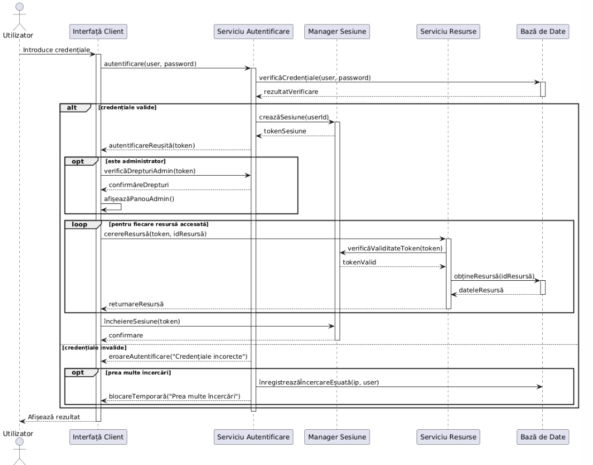
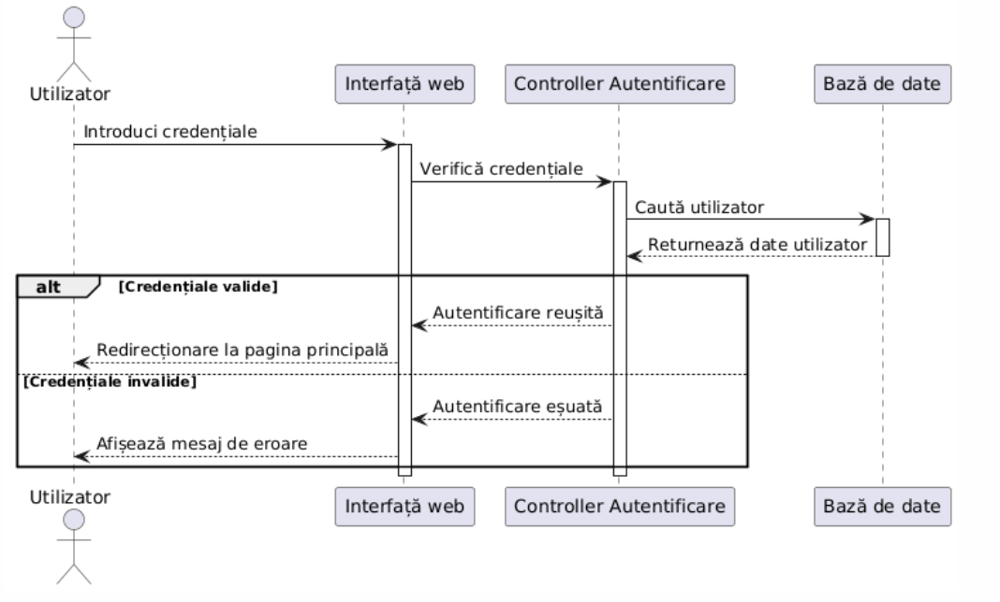
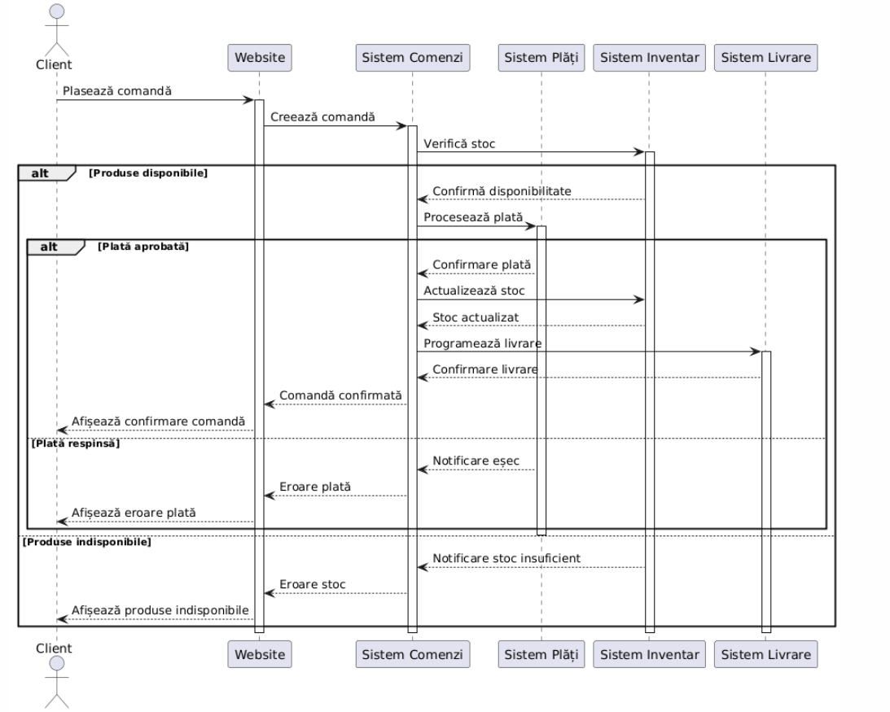
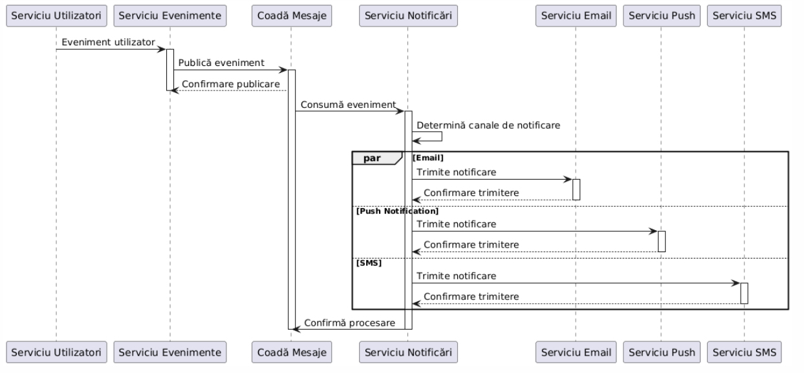
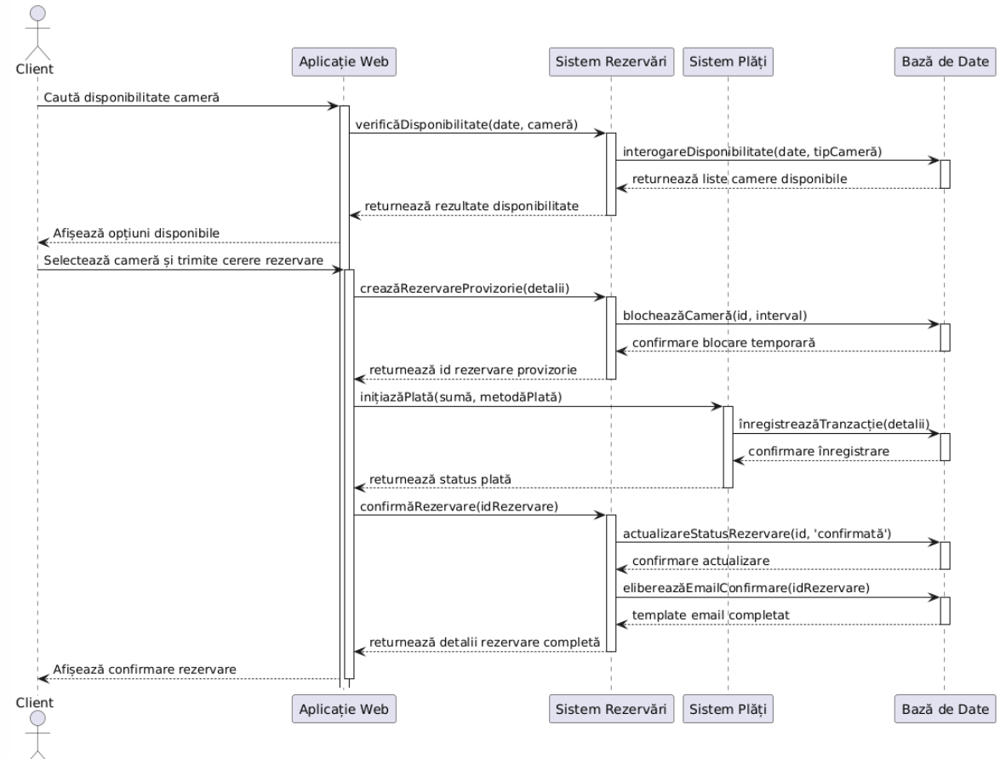
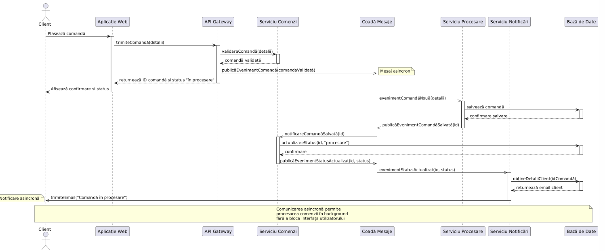

# Documentație Diagrame UML de Secvență

## Cuprins
1. [Introducere](#introducere)
2. [Concepte fundamentale](#concepte-fundamentale)
3. [Elementele unei diagrame de secvență](#elementele-unei-diagrame-de-secvență)
4. [Notația PlantUML](#notația-plantuml)
5. [Exemple practice](#exemple-practice)
6. [Bune practici](#bune-practici)
7. [Resurse suplimentare](#resurse-suplimentare)

## Introducere

Diagramele UML de secvență sunt instrumente esențiale pentru modelarea comportamentului dinamic al unui sistem. Acestea descriu schimbul de mesaje dintre obiecte sau componente într-un anumit context, în funcție de ordinea temporală a interacțiunilor.

În fazele inițiale de analiză a cerințelor, diagramele pot fi folosite pentru a reprezenta scenarii de utilizare, evidențiind modul în care actorii (utilizatorii sau alte sisteme externe) interacționează cu funcționalitățile sistemului. Astfel, contribuie la validarea și rafinarea cerințelor funcționale.

În etapa de proiectare și documentare tehnică, aceleași diagrame sunt utile pentru a descrie cum colaborează componentele, clasele sau serviciile între ele pentru a îndeplini un anumit proces. Ele ajută la identificarea dependențelor, a responsabilităților și a posibilelor puncte de cuplare strânsă, fiind utile atât în dezvoltare, cât și în mentenanță.

Diagramele de secvență sunt folosite în principal pentru:
- Modelarea interacțiunilor între utilizatori, sisteme și componente
- Documentarea și validarea logicii de afaceri
- Ilustrarea și validarea cazurilor de utilizare
- Descoperirea serviciilor requiruite de o clasă

## Concepte fundamentale

### Axele temporale

Într-o diagramă de secvență există două axe principale:
- **Axa verticală**: Reprezintă timpul, care curge de sus în jos. Evenimentele care apar mai sus pe diagramă se întâmplă înaintea celor de mai jos.
- **Axa orizontală**: Reprezintă diferitele obiecte sau participanți implicați în interacțiune.

### Liniile de viață

Fiecare participant în diagramă are o linie de viață (lifeline) - o linie verticală punctată care reprezintă existența obiectului de-a lungul timpului.

### Mesaje

Mesajele sunt reprezentate prin săgeți între liniile de viață și arată interacțiunile între obiecte. Tipul de săgeată indică tipul de mesaj (sincronic, asincronic, răspuns, etc.).

## Elementele unei diagrame de secvență

### Participanți

Participanții (actori, obiecte, componente) sunt reprezentați în partea de sus a diagramei. Aceștia pot fi:
- **Actori**: Reprezintă utilizatori sau sisteme externe care interacționează cu sistemul.
- **Obiecte**: Instance ale claselor din sistem.
- **Componente**: Părți ale sistemului cu rol specific.

### Tipuri de mesaje

1. **Mesaje sincrone**: Expeditorul așteaptă un răspuns înainte de a continua.
    - Reprezentate prin săgeți cu cap plin (→)

2. **Mesaje asincrone**: Expeditorul nu așteaptă un răspuns pentru a continua.
    - Reprezentate prin săgeți cu cap deschis (-->)

3. **Mesaje de răspuns**: Răspunsuri la mesajele anterioare.
    - Reprezentate prin linii punctate cu cap deschis (- - ->)

4. **Mesaje create**: Indică crearea unui nou obiect.
    - Săgeata indică spre simbolul noului obiect

5. **Mesaje de distrugere**: Indică terminarea existenței unui obiect.
    - Se termină cu un X pe linia de viață

### Casetele de activare

Casetele de activare (activation boxes) sunt dreptunghiuri plasate pe linia de viață a unui obiect și reprezintă perioada în care obiectul execută o operație.

### Fragmente combinative

Fragmente combinative (combined fragments) sunt regiuni din diagramă care grupează mesaje conform anumitor condiții operaționale. Cele mai comune sunt:

1. **alt** (alternative): Reprezintă o condiție if-then-else
2. **opt** (opțional): Reprezintă o condiție if
3. **loop**: Reprezintă un ciclu
4. **par** (parallel): Reprezintă procese care se execută în paralel
5. **ref** (reference): Referință la o altă diagramă de secvență

## Exemple practice

### Exemplul 1: Autentificare utilizator

### Exemplul 2: Procesare comandă online

### Exemplul 3: Microservicii - Sistem de notificări

### Exemplul 4: Aplicație rezervari hotel

### Exemplu 5: Sistem prelucrare comenzi

## Bune practici

### Când să folosiți diagrame de secvență

- Pentru a ilustra fluxul de control în scenarii complexe
- Pentru a documenta interacțiunile între componente distribuite
- Pentru a valida și rafina arhitectura sistemului
- Pentru a comunica comportamentul sistemului cu stakeholderii

### Sfaturi pentru diagrame eficiente

1. **Mențineți claritatea**: Nu supraîncărcați diagrama cu prea multe detalii.
2. **Utilizați fragmente combinative**: Folosiți fragmente pentru a ilustra logic compactă.
3. **Organizați pe verticală**: Păstrați cronologia clară, cu evenimentele timpurii în partea de sus.
4. **Grupați funcționalități conexe**: Utilizați referințe (ref) pentru a extrage secvențe comune.
5. **Adnotați**: Utilizați note pentru a explica decizii sau logică complexă.
6. **Alegeți nume descriptive**: Folosiți nume sugestive pentru participanți și mesaje.
7. **Limitați scopul**: O diagramă ar trebui să ilustreze un singur scenariu sau caz de utilizare.

## Resurse suplimentare

- [Documentația oficială PlantUML](https://plantuml.com/sequence-diagram)
- [OMG UML Specification](https://www.omg.org/spec/UML/)
- [Visual Paradigm - UML Sequence Diagrams](https://www.visual-paradigm.com/guide/uml-unified-modeling-language/what-is-sequence-diagram/)
- [Lucidchart - UML Sequence Diagram Tutorial](https://www.lucidchart.com/pages/uml-sequence-diagram)

