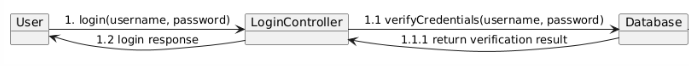
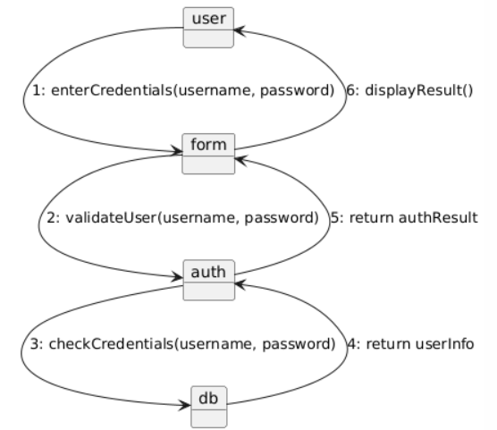
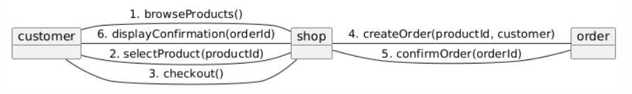
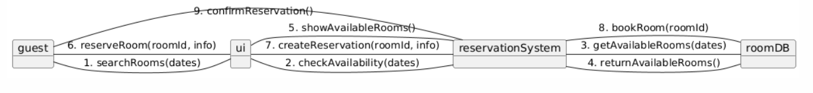
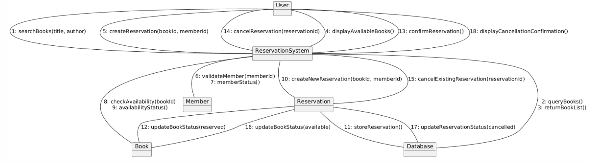

# Documentație Diagrame UML de Comunicare

## Cuprins
1. [Introducere](#introducere)
2. [Concepte fundamentale](#concepte-fundamentale)
3. [Elementele unei diagrame de comunicare](#elementele-unei-diagrame-de-comunicare)
4. [Notația PlantUML](#notația-plantuml)
5. [Exemple practice](#exemple-practice)
6. [Bune practici](#bune-practici)
7. [Resurse suplimentare](#resurse-suplimentare)

## Introducere

Diagramele UML de comunicare (cunoscute anterior ca diagrame de colaborare) sunt instrumente pentru modelarea interacțiunilor dintre obiectele unui sistem. Spre deosebire de diagramele de secvență care accentuează ordinea temporală, diagramele de comunicare evidențiază relațiile structurale între obiecte și modul în care acestea colaborează.

În faza de analiză a cerințelor, diagramele de comunicare pot fi folosite pentru a explora și documenta interacțiunile dintre diferite entități din perspectiva organizării spațiale, punând accent pe "cine comunică cu cine" mai degrabă decât pe ordinea exactă a mesajelor.

În etapa de proiectare, aceste diagrame sunt valoroase pentru a vizualiza rețeaua de conexiuni dintre componente, evidențiind dependențele și responsabilitățile în cadrul arhitecturii sistemului. Ele oferă o viziune complementară diagramelor de secvență, fiind mai potrivite pentru sisteme cu multe obiecte și relații complexe.

Diagramele de comunicare sunt folosite în principal pentru:
- Vizualizarea rețelei de obiecte și a relațiilor dintre ele
- Ilustrarea fluxului de mesaje într-un context spațial
- Evidențierea colaborărilor necesare pentru realizarea unei funcționalități
- Documentarea arhitecturii de comunicare a sistemului

## Concepte fundamentale

### Organizarea spațială

Într-o diagramă de comunicare, importantă este organizarea spațială:
- Participanții (obiectele) sunt plasați în funcție de relațiile structurale dintre ei
- Mesajele sunt reprezentate ca săgeți între obiecte
- Ordinea mesajelor este indicată prin numere secvențiale

### Secvențialitatea mesajelor

Deși nu există o axă temporală explicită, ordinea mesajelor este indicată prin numere secvențiale (1, 2, 3...). Submesajele sau mesajele într-un context ierarhic sunt numerotate folosind notația punctată (1.1, 1.2, etc.).

## Elementele unei diagrame de comunicare

### Participanți

Participanții sunt reprezentați ca dreptunghiuri și pot fi:
- **Actori**: Utilizatori sau sisteme externe
- **Obiecte**: Instanțe ale claselor
- **Componente**: Subsisteme sau module funcționale

### Legături

Legăturile sunt linii care conectează participanții și reprezintă canalele de comunicare. Acestea pot fi:
- **Asocieri simple**: Fără specificații suplimentare
- **Asocieri cu roluri**: Cu etichete ce descriu rolul obiectului în relație

### Mesaje

Mesajele sunt reprezentate ca săgeți etichetate care traversează legăturile dintre obiecte.

### Tipuri de mesaje

1. **Mesaje sincrone**: Expeditorul așteaptă un răspuns înainte de a continua.
    - Reprezentate prin săgeți cu cap plin

2. **Mesaje asincrone**: Expeditorul nu așteaptă un răspuns pentru a continua.
    - Reprezentate prin săgeți cu cap deschis

### Condiții și iterații

Condițiile și iterațiile sunt reprezentate în cadrul etichetelor mesajelor:
- **Condiții**: Sunt indicate între paranteze pătrate [condiție]
- **Iterații**: Sunt indicate prin asterisc urmat de specificator de iterație *[pentru fiecare element]

## Exemple practice

### Exemplul 1: Sistem de autentificare

### Exemplul 2: Procesare comandă online

### Exemplul 3: Sistem rezervări hotel

### Exemplul 4: Sistem gestionare bibliotecă

## Bune practici

### Când să folosiți diagrame de comunicare

- Pentru a evidenția cine comunică cu cine într-un sistem
- Când organizarea spațială a obiectelor este importantă
- Pentru sisteme cu mulți participanți și relații complexe
- Ca alternativă la diagramele de secvență când fluxul temporal este secundar

### Sfaturi pentru diagrame eficiente

1. **Organizare clară**: Aranjați obiectele pentru a minimiza încrucișarea legăturilor
2. **Grupare logică**: Plasați împreună obiectele care colaborează frecvent
3. **Utilizați numerotarea corectă**: Mențineți o schemă de numerotare consistentă și clară
4. **Limitați numărul de mesaje**: Focalizați-vă pe interacțiunile esențiale
5. **Adăugați comentarii**: Utilizați note pentru a explica logica complexă
6. **Echilibrați detaliile**: Includeți suficiente detalii pentru înțelegere, dar evitați supraîncărcarea
7. **Combinați cu alte diagrame**: Utilizați împreună cu diagrame de secvență pentru o imagine completă

### Diferențe față de diagramele de secvență

| Diagramă de comunicare | Diagramă de secvență |
|------------------------|----------------------|
| Accentuează relațiile structurale | Accentuează ordinea temporală |
| Organizare spațială flexibilă | Organizare liniară pe axa temporală |
| Numerotare explicită a mesajelor | Poziționare implicită în funcție de timp |
| Mai potrivită pentru sisteme cu multe obiecte | Mai potrivită pentru secvențe complexe de mesaje |
| Evidențiază "cine cu cine comunică" | Evidențiază "când se întâmplă fiecare interacțiune" |

## Resurse suplimentare

- [Visual Paradigm - UML Communication Diagrams](https://www.visual-paradigm.com/guide/uml-unified-modeling-language/what-is-communication-diagram/)
- [Lucidchart - UML Communication Diagram Tutorial](https://www.lucidchart.com/pages/uml-communication-diagram)
- [IBM Knowledge Center - Communication Diagrams](https://www.ibm.com/docs/en/rational-soft-arch/9.7.0?topic=diagrams-communication)