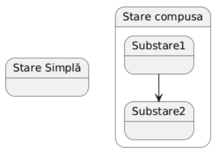
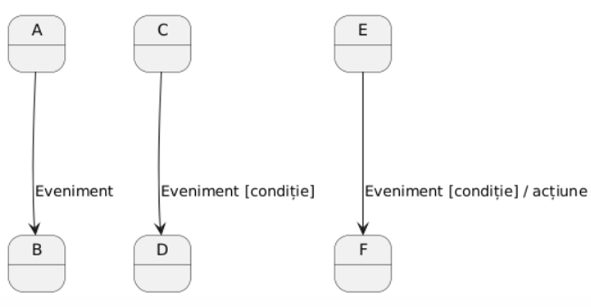
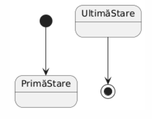
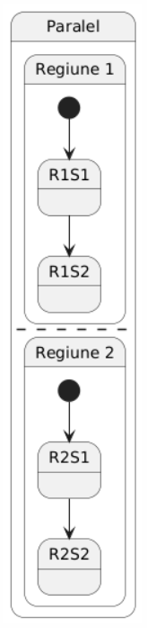
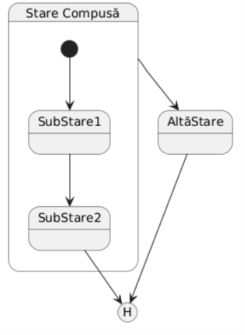
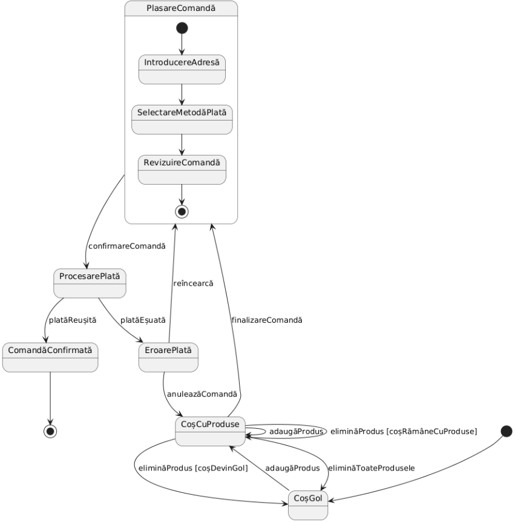
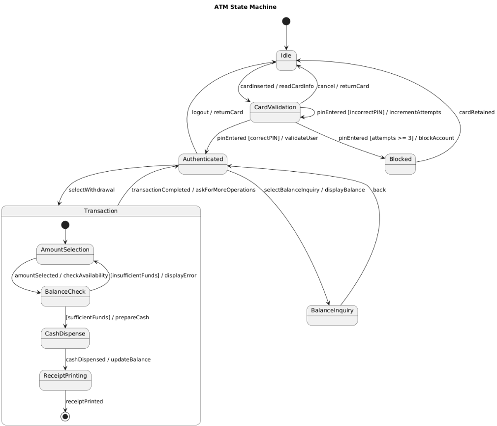
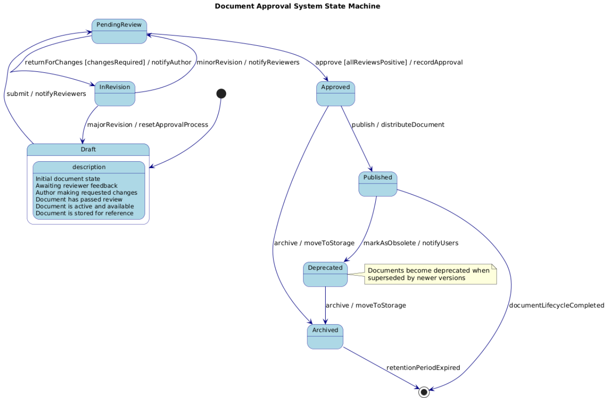

# Documentație Diagrame UML de Stare (State Machine)

## Introducere

Diagramele de stare (state machine diagrams) sunt un tip de diagrame comportamentale din familia Unified Modeling Language (UML) care descriu comportamentul unui sistem în funcție de stările sale și de tranzițiile între acestea. Aceste diagrame sunt esențiale pentru modelarea sistemelor reactive și orientate pe evenimente, oferind o reprezentare vizuală a modului în care un obiect își schimbă starea ca răspuns la diverse evenimente.

Diagramele de stare sunt deosebit de utile în următoarele contexte:
- Proiectarea sistemelor complexe cu multiple stări de funcționare
- Modelarea interfeței cu utilizatorul și a fluxurilor de interacțiune
- Definirea protocoalelor de comunicare
- Implementarea sistemelor reactive sau bazate pe evenimente
- Specificarea comportamentului obiectelor în timp

Originile diagramelor de stare pot fi trasate până la conceptul de automat finit (finite state machine) din teoria computațională, fiind adaptate și extinse în contextul modelării orientate pe obiecte.

## Concepte fundamentale

### 1. State (Stare)

O stare reprezintă o condiție sau situație în timpul vieții unui obiect în care acesta satisface anumite condiții, efectuează anumite activități sau așteaptă un anumit eveniment. Un obiect rămâne într-o stare pentru o perioadă finită de timp.

**Tipuri de stări:**
- **Stare inițială** - punctul de start al mașinii de stare
- **Stare finală** - punctul în care mașina de stare își încheie execuția
- **Stare simplă** - stare fără substări
- **Stare compusă** - stare care conține substări
- **Stare submașină** - stare care face referire la o altă mașină de stare
- **Stare istorie** - stare care "ține minte" ultima substare activă
- **Stare paralelă** - stare divizată în regiuni concurente

### 2. Tranziție

O tranziție reprezintă trecerea de la o stare la alta, de obicei declanșată de un eveniment. Tranzițiile pot avea condiții de gardă și pot executa acțiuni atunci când sunt traversate.

Componentele unei tranziții:
- **Eveniment declanșator** - stimulul care inițiază tranziția
- **Condiție de gardă** - condiție care trebuie să fie adevărată pentru ca tranziția să fie executată
- **Efect/Acțiune** - comportament executat la traversarea tranziției

### 3. Eveniment

Un eveniment este un stimul semnificativ care poate declanșa o tranziție între stări. Evenimentele pot fi:
- **Eveniment de semnal** - un semnal extern primit de obiect
- **Eveniment de apel** - invocarea unei operații
- **Eveniment de timp** - trecerea unui interval de timp specificat
- **Eveniment de schimbare** - modificarea unei condiții specificate

### 4. Acțiune și Activitate

- **Acțiune** - comportament atomic, neîntreruptibil
- **Activitate** - comportament care durează în timp și poate fi întrerupt


## Notația PlantUML

PlantUML este un instrument care permite crearea diagramelor UML, inclusiv diagrame de stare, utilizând un limbaj simplu de text. Sintaxa de bază pentru diagramele de stare în PlantUML este:

```plantuml
@startuml
[* --> Stare1
Stare1 --> Stare2 : Eveniment1
Stare2 --> Stare3 : Eveniment2
Stare3 --> [*
@enduml
```

### Elemente de bază în PlantUML pentru diagramele de stare

#### 1. Stări



#### 2. Tranziții



#### 3. Stări inițiale și finale



#### 5. Stări ortogonale (paralele)



#### 6. Stări istorie



## Exemple practice

### Exemplul : Proces de comandă online



### Exemplul : ATM



### Exemplul : Document approval



## Bune practici

### 1. Claritate și lizibilitate
- Utilizați nume clare și descriptive pentru stări și tranziții
- Evitați diagramele aglomerate cu prea multe stări
- Organizați stările în mod logic pe baza relațiilor lor
- Folosiți stări compuse pentru a grupa stările conexe
- Adnotați diagrama cu note explicative unde este necesar

### 2. Granularitate adecvată
- Alegeți nivelul potrivit de detaliu pentru contextul diagramei
- Folosiți stări compuse și submașini pentru a gestiona complexitatea
- Creați diagrame separate pentru niveluri diferite de detaliu

### 3. Completitudine
- Asigurați-vă că toate stările au un mod de a fi atinse
- Definiți tranziții pentru toate evenimentele posibile în fiecare stare
- Includeți tranziții de eroare și tratarea excepțiilor
- Verificați că nu există stări "dead-end" (în afară de stările finale)

### 4. Evitarea capcanelor comune
- Evitați tranzițiile necondiționionate multiple din aceeași stare
- Evitați condițiile de gardă contradictorii
- Evitați stările tranzitorii inutile

